# Entrega - Unidade 2

Esta seção reúne os artefatos, apresentações e registros de validação referentes à segunda unidade do projeto.

---

## Apresentação da Unidade

### Vídeo da Apresentação

  <iframe src="https://unbbr-my.sharepoint.com/personal/231029270_aluno_unb_br/_layouts/15/embed.aspx?UniqueId=7c11bae5-28c3-4bf5-99d3-3587cb6ff0a8&embed=%7B%22ust%22%3Afalse%7D&referrer=StreamWebApp&referrerScenario=EmbedDialog.Create" width="640" height="360" frameborder="0" scrolling="no" allowfullscreen title="Apresentação unidade 2-20260518_234336-Gravação de Reunião.mp4"></iframe>

### Slides

  <iframe src="../../assets/unidade2/Unidade2.pdf" title="Visualização dos slides da Unidade 1" style="display: block; width: 100%; height: 80vh; border: 0; background-color: #111;"></iframe>

  <a href="../../assets/unidade2/Unidade2.pdf" download="Unidade2.pdf" style="display: inline-flex; align-items: center; gap: 8px; padding: 12px 24px; background-color: #F6E9D9; color: #111; text-decoration: none; border-radius: 5px; font-weight: bold; text-align: center;">
    <svg xmlns="http://www.w3.org/2000/svg" width="16" height="16" viewBox="0 0 24 24" fill="none" stroke="currentColor" stroke-width="2" stroke-linecap="round" stroke-linejoin="round" aria-hidden="true">
      <path d="M21 15v4a2 2 0 0 1-2 2H5a2 2 0 0 1-2-2v-4" />
      <polyline points="7 10 12 15 17 10" />
      <line x1="12" y1="15" x2="12" y2="3" />
    </svg>
    Baixar em PDF
  </a>
  <a href="../../assets/unidade2/Unidade2.pptx" download="Unidade2.pptx" style="display: inline-flex; align-items: center; gap: 8px; padding: 12px 24px; background-color: #F6E9D9; color: #111; text-decoration: none; border-radius: 5px; font-weight: bold; text-align: center;">
    <svg xmlns="http://www.w3.org/2000/svg" width="16" height="16" viewBox="0 0 24 24" fill="none" stroke="currentColor" stroke-width="2" stroke-linecap="round" stroke-linejoin="round" aria-hidden="true">
      <path d="M21 15v4a2 2 0 0 1-2 2H5a2 2 0 0 1-2-2v-4" />
      <polyline points="7 10 12 15 17 10" />
      <line x1="12" y1="15" x2="12" y2="3" />
    </svg>
    Baixar em PPTX
  </a>

---

## Reuniões e Validações com a Cliente

Abaixo estão os registros, players de gravação e atas das reuniões realizadas com a cliente, documentando a evolução desde a concepção do escopo até a priorização final do MVP.

---

### 1. Revisão e Validação Inicial do Documento de Visão

**Objetivo:** Validar o problema central, os objetivos e o escopo preliminar do projeto (Iteração 1).

  <iframe src="https://unbbr-my.sharepoint.com/personal/231029270_aluno_unb_br/_layouts/15/embed.aspx?UniqueId=0aa37717-9e2e-4a40-8b3f-247a698cdbbd&embed=%7B%22ust%22%3Afalse%2C%22hv%22%3A%22CopyEmbedCode%22%7D&referrer=StreamWebApp&referrerScenario=EmbedDialog.Create" width="640" height="360" frameborder="0" scrolling="no" allowfullscreen title="Reunião Requisitos Nativo-20260414_190754-Gravação de Reunião.mp4"></iframe>

**Resumo da Reunião:** Nesta primeira validação, a equipe apresentou à cliente o mapeamento inicial do escopo do projeto. A discussão foi centrada no alinhamento das expectativas quanto às necessidades da comunidade Munduruku, validando a premissa de que a aplicação precisa de mecanismos sociais e interativos para reter usuários. Os primeiros tópicos do Documento de Visão foram consolidados.

---

### 2. Alinhamento sobre Capacidade Técnica e Tecnologias

**Objetivo:** Mapear gargalos técnicos da arquitetura legada (Flask) e validar a capacidade da equipe de propor melhorias estruturais.

  <iframe src="https://unbbr-my.sharepoint.com/personal/231029270_aluno_unb_br/_layouts/15/embed.aspx?UniqueId=16039a7a-62cb-4b2f-a357-a143b8c003d1&embed=%7B%22ust%22%3Afalse%2C%22hv%22%3A%22CopyEmbedCode%22%7D&referrer=StreamWebApp&referrerScenario=EmbedDialog.Create" width="640" height="360" frameborder="0" scrolling="no" allowfullscreen title="Reunião Requisitos Nativo-20260414_190754-Gravação de Reunião (1).mp4"></iframe>

**Resumo da Reunião:** Sessão dedicada ao alinhamento técnico do projeto. A equipe debateu com a cliente o estado atual da base de código, as integrações e as tecnologias empregadas no desenvolvimento original. O objetivo foi assegurar que as novas funcionalidades propostas fossem técnica e arquiteturalmente viáveis antes de avançar para a fase de elaboração dos requisitos detalhados.

---

### 3. Análise e Validação das User Stories (MoSCoW)

**Objetivo:** Apresentar as Histórias de Usuário derivadas da visão inicial e iniciar a classificação de valor.

  <iframe src="https://unbbr-my.sharepoint.com/personal/231029270_aluno_unb_br/_layouts/15/embed.aspx?UniqueId=76101124-27a4-432f-9c41-e0bf24392aa9&embed=%7B%22ust%22%3Afalse%2C%22hv%22%3A%22CopyEmbedCode%22%7D&referrer=StreamWebApp&referrerScenario=EmbedDialog.Create" width="640" height="360" frameborder="0" scrolling="no" allowfullscreen title="Reunião com Pedro Henrique Martins Silva-20260428_194226-Gravação de Reunião.mp4"></iframe>

**Resumo da Reunião:** Avançando para a Fase de Elaboração (Iteração 2 e 3), a equipe traduziu as Características do Produto (CPs) em Histórias de Usuário. Durante a sessão, as "User Stories" foram avaliadas pela cliente utilizando a técnica MoSCoW, separando o que é essencial para o sucesso do projeto daquilo que pode ser tratado como diferencial (desejável) em entregas futuras.

### Priorização MoSCoW 

  <iframe src="../../assets/unidade2/Histórias de Usuário.pdf" title="Visualização dos slides da Unidade 1" style="display: block; width: 100%; height: 80vh; border: 0; background-color: #111;"></iframe>

---

### 4. Validação de Funcionalidades

**Objetivo:** Demonstrar o fluxo de usabilidade das novas mecânicas de interação (Feed Social e Gamificação) para captura de feedback (Iteração 3).

  <iframe src="https://unbbr-my.sharepoint.com/personal/231029270_aluno_unb_br/_layouts/15/embed.aspx?UniqueId=d31d7d72-e5f6-48d9-bf54-befa2452326c&embed=%7B%22ust%22%3Afalse%2C%22hv%22%3A%22CopyEmbedCode%22%7D&referrer=StreamWebApp&referrerScenario=EmbedDialog.Create" width="640" height="360" frameborder="0" scrolling="no" allowfullscreen title="Validação de requisios-20260512_193458-Gravação de Reunião.mp4"></iframe>

**Resumo da Reunião:** Foco na experiência do usuário e na validação das funcionalidades ligadas ao **OE1 (Aumentar engajamento)**. A equipe discutiu as regras de negócio por trás do Feed Social Comunitário (CP2) e dos Mecanismos Interativos (CP1). Foram debatidas as formas de interação (curtidas, comentários) e a estrutura de criação de eventos para garantir que se adequassem à realidade de uso da aldeia.

---

### 5. Validação dos Requisitos Funcionais

**Objetivo:** Revisão da lista final de 49 Requisitos Funcionais, focando em permissões, segurança e multimídia (Iteração 4).

  <iframe src="https://unbbr-my.sharepoint.com/personal/231029270_aluno_unb_br/_layouts/15/embed.aspx?UniqueId=7871c305-d9c8-4e9c-9671-c9c8042f9618&embed=%7B%22ust%22%3Afalse%2C%22hv%22%3A%22CopyEmbedCode%22%7D&referrer=StreamWebApp&referrerScenario=EmbedDialog.Create" width="640" height="360" frameborder="0" scrolling="no" allowfullscreen title="Validação de requisios-20260512_193458-Gravação de Reunião (1).mp4"></iframe>

**Resumo da Reunião:** Passagem formal pela Especificação Suplementar consolidada. A cliente validou processos críticos do **OE2 (Segurança)** e **OE3 (Experiência)**. Destaques da validação:
* **Controle de Usuários e Denúncias (CP3 e CP4):** Validação dos fluxos de banimento, alteração de cargos e gestão de denúncias para manter um ambiente seguro.
* **Multimídia (CP5):** Definição estrita de que apenas os usuários com perfil de **Professor** devem ter o poder de associar vídeos e áudios diretamente às traduções no processo educacional.

---

### 6. Priorização Final e Definição do MVP

**Objetivo:** Aplicar a Matriz de Quadrantes (Impacto no Negócio vs. Dificuldade Técnica) para estabelecer a Baseline oficial do backlog e definir o escopo do MVP (Iteração 4).

  <iframe src="https://unbbr-my.sharepoint.com/personal/231029270_aluno_unb_br/_layouts/15/embed.aspx?UniqueId=e68df060-0ebd-472a-9a19-0ed08cf63293&embed=%7B%22ust%22%3Afalse%2C%22hv%22%3A%22CopyEmbedCode%22%7D&referrer=StreamWebApp&referrerScenario=EmbedDialog.Create" width="640" height="360" frameborder="0" scrolling="no" allowfullscreen title="Validação de requisios-20260512_201718-Gravação de Reunião.mp4"></iframe>

**Resumo da Reunião:**
Nesta sessão de encerramento da Fase de Elaboração, a equipe realizou a priorização estratégica do backlog por meio de uma **Matriz de Impacto no Negócio vs. Dificuldade Técnica**, estabelecendo o escopo do *Minimum Viable Product* (MVP). Cada um dos requisitos foi avaliado sob a ótica do valor entregue aos objetivos do projeto (como engajamento, preservação linguística, acessibilidade e segurança) em equilíbrio com a complexidade de engenharia envolvida (dependências do legado em Flask, persistência no Firebase e gerenciamento de mídias).

Os itens foram mapeados em quatro quadrantes orientadores para a tomada de decisão:

* **Alto Impacto e Baixa Dificuldade Técnica:** Considerados de prioridade máxima por entregarem valor imediato com riscos reduzidos.
* **Alto Impacto e Alta Dificuldade Técnica:** Classificados como importantes, demandando planejamento detalhado, validações contínuas e fatiamento em entregas incrementais.
* **Baixo Impacto e Baixa Dificuldade Técnica:** Identificados como requisitos complementares, a serem desenvolvidos segundo a disponibilidade da equipe.
* **Baixo Impacto e Alta Dificuldade Técnica:** Definidos como menor prioridade devido ao alto esforço de engenharia sem retorno proporcional imediato para o produto.

Essa abordagem serviu como uma organização inicial e ponto de partida para debates técnicos amadurecidos. Cruzando os dados da matriz com os alinhamentos de regras de negócio feitos com a cliente e as dependências estruturais do sistema, a equipe obteve uma visão holística que evitou escolhas arbitrárias ou individuais, blindando o planejamento e selecionando os requisitos mais críticos para consolidar a experiência principal do aplicativo de forma estável.

## Board do Miro

<iframe width="100%" height="500" src="https://miro.com/app/board/uXjVHUP59J4=/?share_link_id=964775775657" title="Matriz de impacto e esforçp" frameborder="0" allow="accelerometer; autoplay; clipboard-write; encrypted-media; gyroscope; picture-in-picture; web-share" allowfullscreen></iframe>
[Matriz de valo e impacto](https://miro.com/app/board/uXjVHUP59J4=/?share_link_id=964775775657)

### Matriz de Priorização

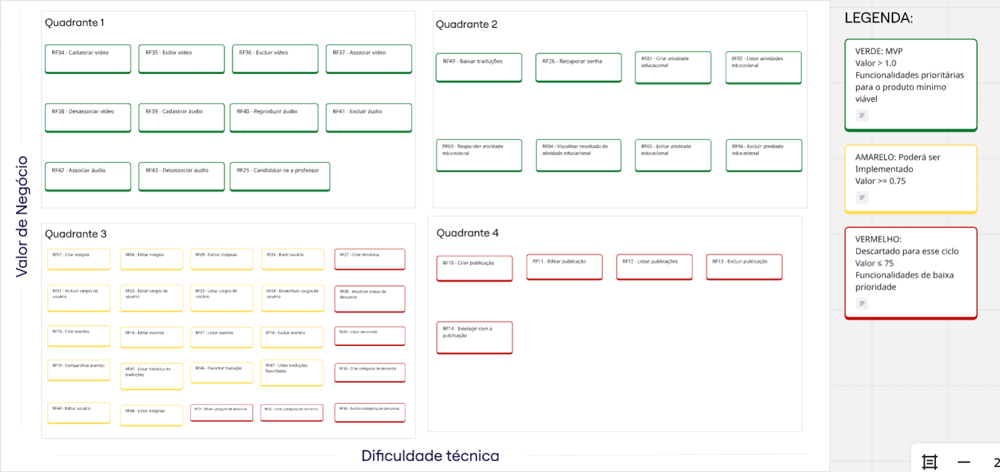
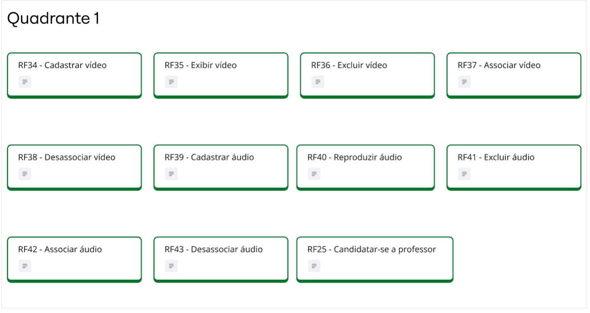
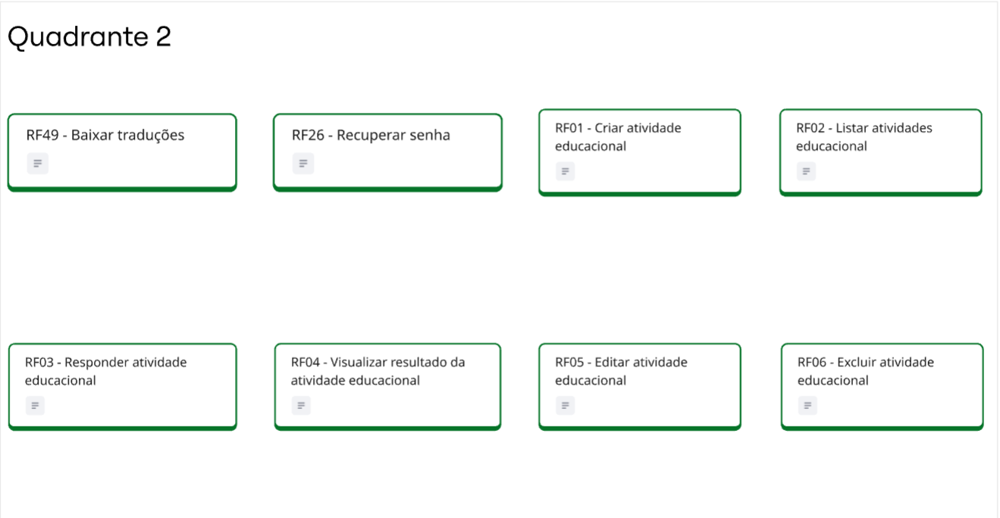
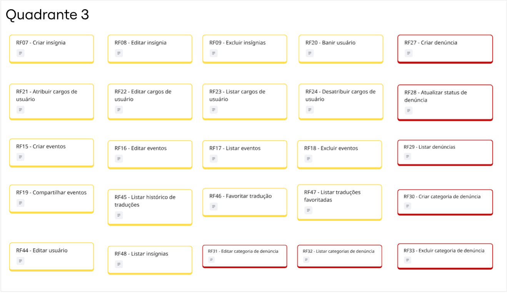
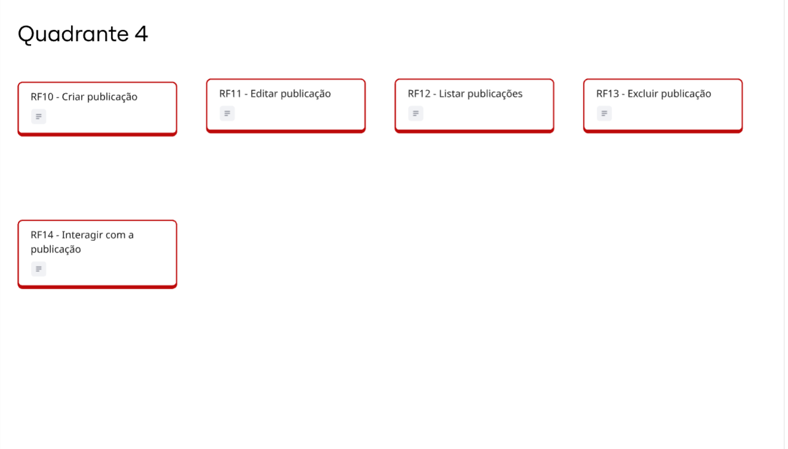

---

### Árvore de Rastreabilidade

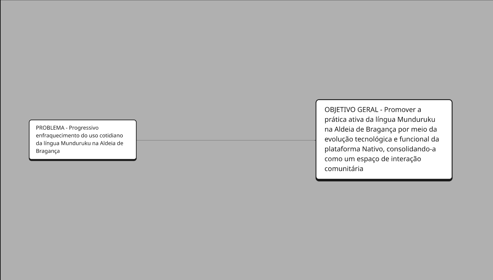
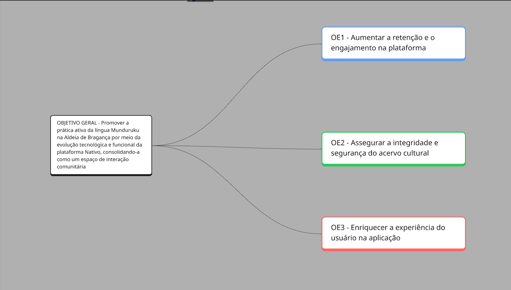
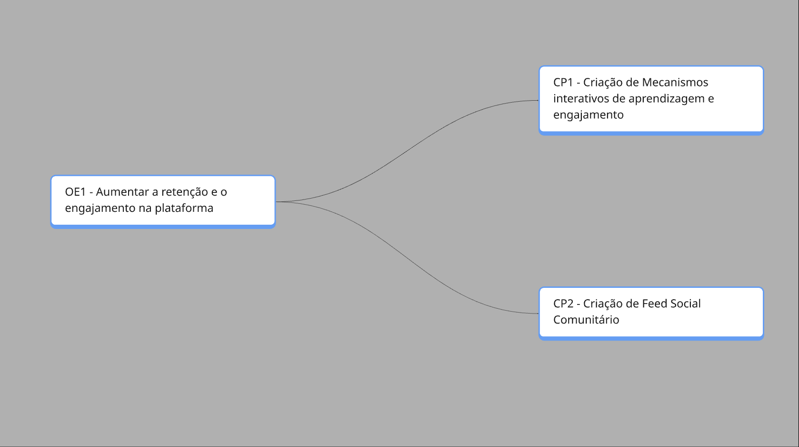
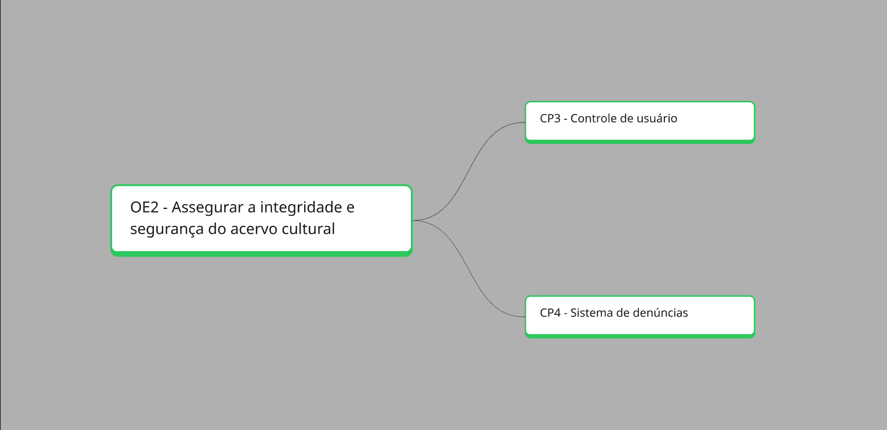
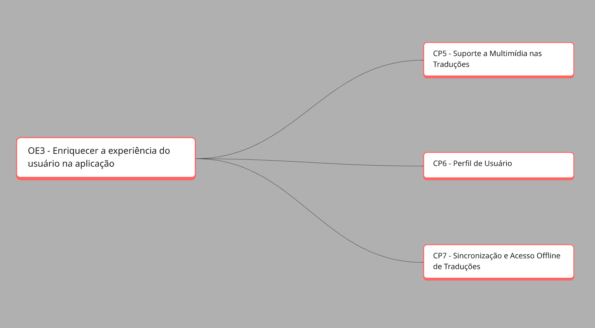
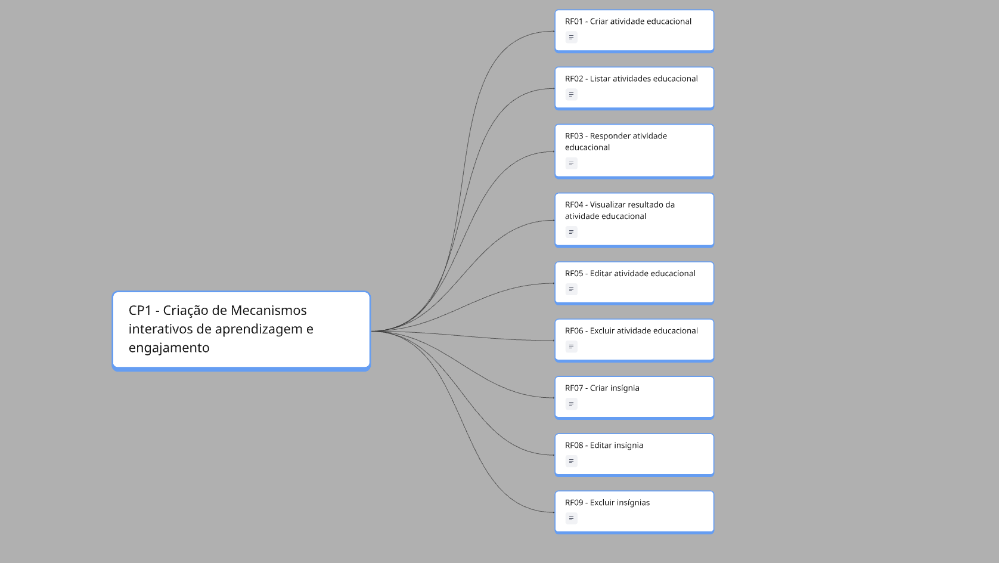
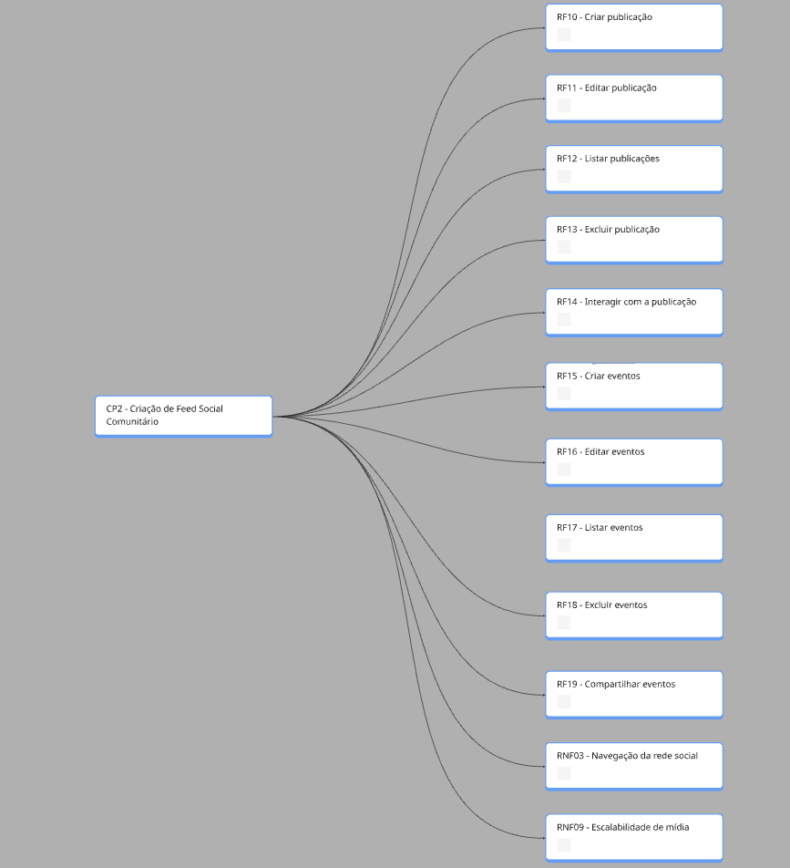
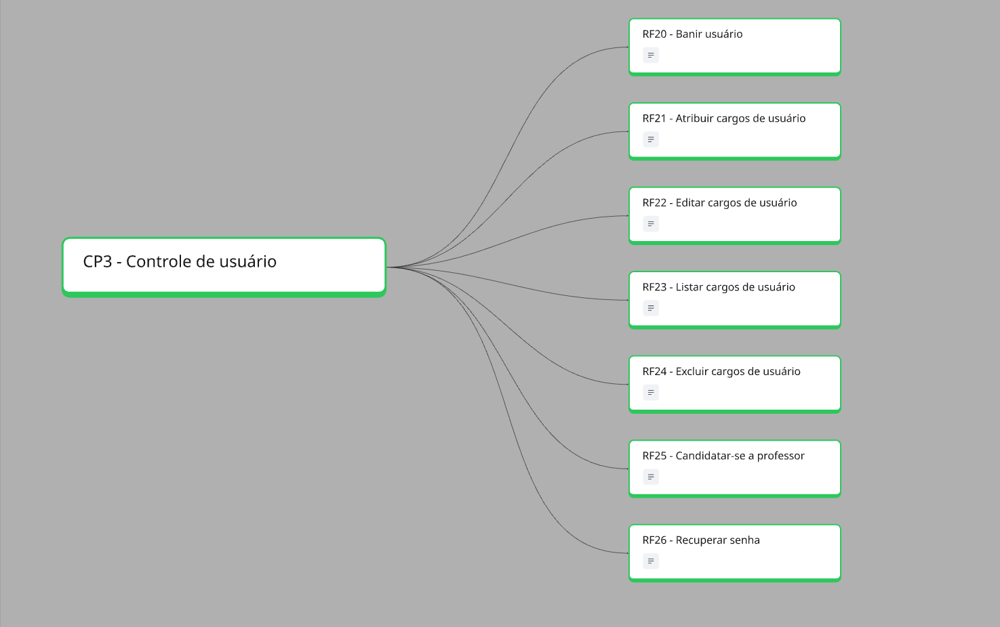
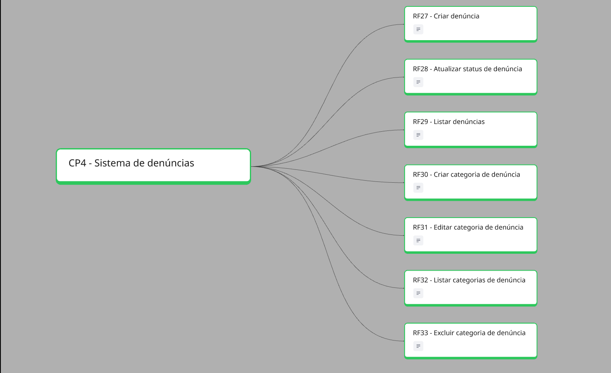
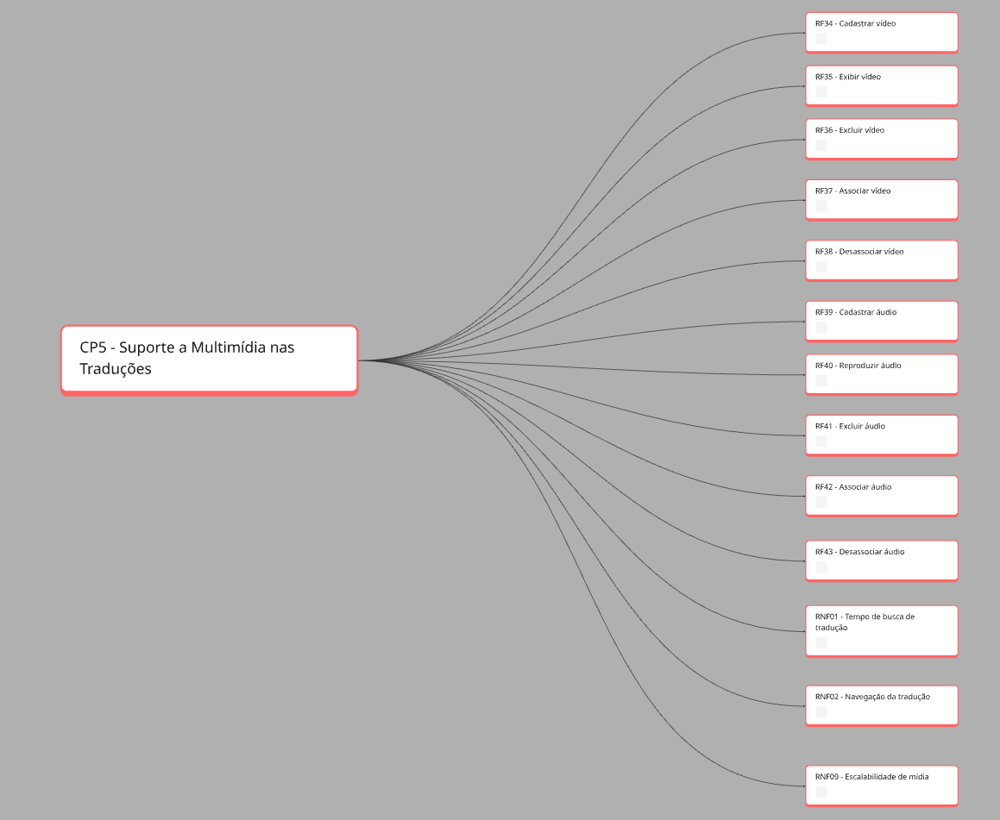
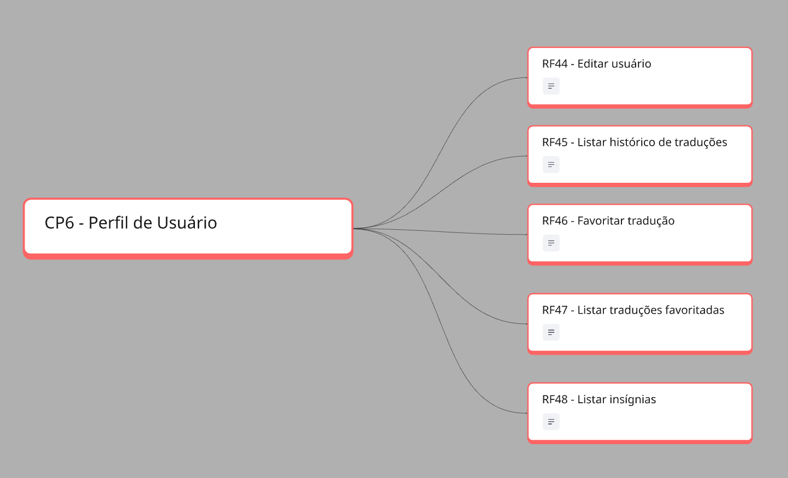
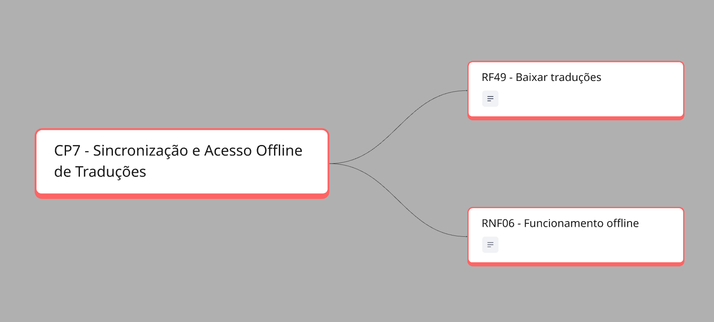

---

