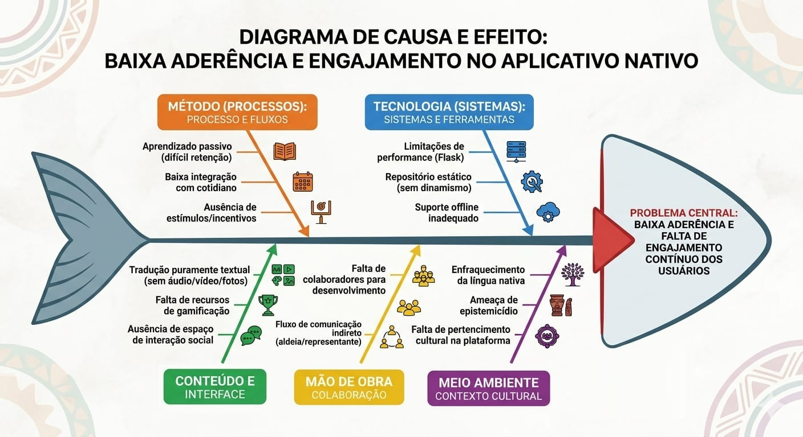

# 1 · Cenário Atual

Esta seção apresenta o contexto do cliente, o negócio envolvido e os problemas identificados que motivam o projeto Nativo.

| Subseção | Conteúdo |
| :--- | :--- |
| [1.1 Identificação do Cliente](cliente.md) | Dados do cliente, representante e forma de contato |
| [1.2 Introdução ao Negócio](negocio.md) | Contexto e missão do aplicativo Nativo |
| [1.3 Rich Picture](rich-picture.md) | Representação visual do sistema e seu contexto |
| [1.4 Oportunidade / Problema](oportunidade.md) | Problema central identificado e seu diagrama de causa |
| [1.5 Desafios do Projeto](desafios.md) | Principais desafios estratégicos e técnicos |
| [1.6 Mapa de Stakeholders](stakeholders.md) | Identificação e análise dos stakeholders |
| [1.7 Segmentação de Usuários](segmentacao.md) | Perfis de usuários da plataforma |

  <a class="section-card" href="cliente/">
    <h3>1.1 Identificação do Cliente</h3>
    
Dados do cliente, representante e forma de contato.

  </a>
  <a class="section-card" href="negocio/">
    <h3>1.2 Introdução ao Negócio</h3>
    
Contexto e missão do aplicativo Nativo.

  </a>
  <a class="section-card" href="rich-picture/">
    <h3>1.3 Rich Picture</h3>
    
Representação visual do sistema e seu contexto.

  </a>
  <a class="section-card" href="oportunidade/">
    <h3>1.4 Oportunidade / Problema</h3>
    
Problema central e diagrama de Ishikawa.

  </a>
  <a class="section-card" href="desafios/">
    <h3>1.5 Desafios do Projeto</h3>
    
Desafios estratégicos e técnicos identificados.

  </a>
  <a class="section-card" href="stakeholders/">
    <h3>1.6 Mapa de Stakeholders</h3>
    
Identificação e análise de influência dos stakeholders.

  </a>
  <a class="section-card" href="segmentacao/">
    <h3>1.7 Segmentação de Usuários</h3>
    
Perfis de usuários da plataforma Nativo.

  </a>

# **1. CENÁRIO ATUAL DO CLIENTE E DO NEGÓCIO**

## **1.1 Identificação do Cliente**

**Nome:** Nativo

**Tipo:** Aplicativo tradutor de línguas indígenas

**Representante:** Alexia Naara da Silva Cardoso, desenvolvedora única do

projeto.

**Forma de contato:** Reuniões por vídeo chamada e contato via aplicativo

de mensagem.

**Vínculo com o projeto:** Desenvolvedora e mantenedora da aplicação,

ponte de comunicação com a aldeia de Bragança, responsável por validar

decisões do projeto e avaliar entregas realizadas.

## **1.2. Introdução ao Negócio e Contexto**

O Nativo é um aplicativo móvel tradutor voltado para a língua indigena Munduruku, com o objetivo de apoiar a revitalização linguística na Aldeia Munduruku de Bragança. Projetado e construído como um projeto de TCC de Alexia Naara a partir da orientação do Professor Doutor Sergio Antônio e coorientado pela Professora Doutora Celia Matsunaga e desenvolvido à tutela do Centro de Estudos, Desenvolvimento e Inovação em Software (CEDIS). O aplicativo conta com tradução bidirecional entre Português e Munduruku, uma sessão informativa, uma página para adicionar e editar traduções, gerenciamento de traduções e de usuários. 

A missão do projeto representa uma importante iniciativa tecnológica voltada à preservação cultural e linguística dos povos originários da Amazônia. O projeto atua no processo de revitalização linguística da aldeia, onde a língua nativa tem perdido espaço e uso cotidiano, ameaçando a preservação das raízes culturais da comunidade. Para enfrentar esse enfraquecimento, o Nativo se propõe como um aplicativo móvel que funciona como um repositório de cultura e tradução bilíngue. No entanto, a aplicação não tem aderência na comunidade.

## **1.3. Rich Picture**
  

## **1.4. Identificação da Oportunidade ou Problema**

A principal oportunidade identificada para o Nativo está relacionada às limitações de engajamento e uso contínuo da plataforma pelos usuários. Embora o aplicativo cumpra sua função básica de tradução bidirecional, observa-se que sua utilização tende a ser pontual e não recorrente, o que reduz seu impacto no processo de preservação e fortalecimento das línguas indígenas.

Esse cenário pode ser explicado por fatores como a baixa integração do aplicativo com o cotidiano dos usuários e a ausência de estímulos que incentivem a prática constante da língua no dia a dia. Como consequência, o aprendizado ocorre de forma passiva, dificultando a retenção do vocabulário e o desenvolvimento de uma relação mais significativa com a língua.

Com isso, a plataforma ainda não se consolida como um espaço de pertencimento cultural ou de troca entre os membros da comunidade, o que limita seu potencial de contribuir de forma mais ampla para o enfrentamento do epistemicídio e para a valorização dos saberes tradicionais.

Dessa forma, o problema central a ser enfrentado é a baixa capacidade da plataforma em promover engajamento contínuo, participação ativa dos usuários e integração com a vivência cultural da comunidade, fatores essenciais para o fortalecimento e a revitalização linguística.

## **1.5. Desafios do Projeto**

O principal desafio estratégico do projeto reside na complexidade do fluxo de comunicação e validação, uma vez que o contato com a comunidade Munduruku não ocorre de forma direta, mas mediado por uma representante, somado à falta de colaboradores para apoiar o desenvolvimento da aplicação. Esse cenário impacta a agilidade do desenvolvimento, dificulta a coleta de feedbacks em tempo real e compromete a realização completa do escopo inicialmente idealizado. Como consequência, decisões sobre evolução do produto, priorização de funcionalidades e validação das entregas tendem a depender de um processo mais lento e sensível a ruídos de comunicação.

Outro desafio relevante é de natureza técnica. A utilização do Flask na arquitetura atual da aplicação tem gerado dificuldades relacionadas à velocidade de funcionamento e à facilidade de evolução do sistema [[5]](#ref5). Isso impacta diretamente a experiência de uso e também reduz a agilidade para implementar melhorias, correções e novas funcionalidades, o que se torna ainda mais crítico em um projeto que demanda expansão contínua e adaptação às necessidades da comunidade atendida.

## **1.6. Mapa de Stakeholders**

Os principais stakeholders do projeto são: Alexia Naara da Silva Cardoso, como cliente e desenvolvedora da aplicação, com alta influência na solução por validar ideias, escopo e entregas; Professor Sergio Freitas, como representante do CEDIS no produto, contribuindo com apoio às necessidades técnicas da aplicação, embora com menor influência nas decisões do projeto; Professor Márcio, como representante da aldeia e principal elo entre a comunidade e a equipe técnica, com alta influência por transmitir aos desenvolvedores as informações e percepções dos validadores; a diretora e os alunos, como validadores do Nativo, exercendo papel central na avaliação dos requisitos implementados e na comunicação de opiniões sobre a adequação da solução ao contexto real de uso; e a equipe de desenvolvimento, responsável por implementar as melhorias propostas e garantir a viabilidade técnica da aplicação, também com alta influência na concretização e evolução do produto.

| Stakeholder | Relação com a solução | Interesse principal | Influência |
| :---: | :---: | :---: | :---: |
| Alexia Naara da Silva Cardoso | Cliente e desenvolvedora da aplicação | Validar ideias, escopo e entregas | Alta |
| Professor Sergio Freitas | Representante do CEDIS no produto | Prestar apoio a necessidades técnicas da aplicação | Baixa |
| Diretora | Validadora institucional do Nativo | Avaliar a adequação da solução ao contexto escolar e às necessidades locais | Alta |
| Alunos | Usuários e validadores do Nativo | Validar e transmitir opiniões sobre os requisitos implementados | Média |
| Professor Márcio | Representante da aldeia e interlocutor com a equipe | Representar a aldeia, comunicar necessidades do contexto real e intermediar a validação da solução | Alta |
| Equipe de desenvolvimento | Desenvolvedores da aplicação | Implementar as melhorias e garantir a viabilidade técnica | Alta | 

## **1.7 Segmentação de Usuários**

O aplicativo Nativo atende a quatro principais segmentos de usuários:

* **Crianças de 6 a 12 anos:** Público que busca a revitalização linguística, utilizando o aplicativo como ferramenta de consulta rápida, aprendizado fonético e associação visual da língua Munduruku.

* **Professores e Educadores:** Atuam como gestores e curadores do conteúdo. Utilizam a plataforma para cadastrar, revisar e organizar o vocabulário nativo, validando a ferramenta para garantir que o conteúdo seja fidedigno.

* **Comunidade e Falantes Nativos:** Representam a base de conhecimento e a memória viva da aldeia. Embora não gerenciem o app diretamente, sua colaboração é a fonte primária para as traduções e registros culturais que os professores inserem no sistema.

* **Pesquisadores e Entusiastas da Língua:** Interessados na preservação da língua Munduruku, utilizam o sistema como um repositório de consulta gramatical e identidade cultural.