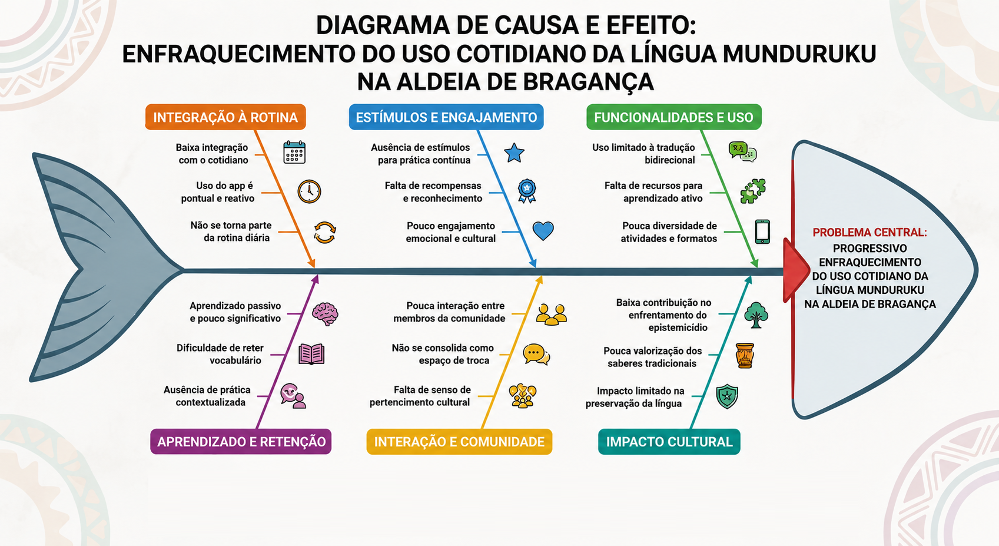

# **1.4. Identificação da Oportunidade ou Problema**

O problema central a ser enfrentado é o **progressivo enfraquecimento do uso cotidiano da língua Munduruku na Aldeia de Bragança**. Esse é um cenário agravado pela falta de engajamento contínuo nas atuais ferramentas de apoio. Assim, a principal oportunidade identificada para a evolução do Nativo reside justamente em **superar as limitações de uso recorrente da plataforma**.

Atualmente, observa-se que a utilização do aplicativo, focada na sua função básica de tradução bidirecional, tende a ser pontual. Esse comportamento reduz significativamente o impacto da ferramenta no processo de preservação e fortalecimento da língua. Esse cenário é explicado pela baixa integração do aplicativo com a rotina dos usuários e pela ausência de estímulos que incentivem a prática constante.

Como consequência, o aprendizado ocorre de forma passiva, o que dificulta a retenção do vocabulário e o desenvolvimento de uma relação mais significativa com o idioma. Sem mecanismos de interação contínua, a plataforma ainda não se consolida como um espaço de pertencimento cultural ou de troca entre os membros da comunidade, limitando seu potencial de contribuir de forma mais ampla para o enfrentamento do epistemicídio e para a valorização dos saberes tradicionais.

## Diagrama de Ishikawa

