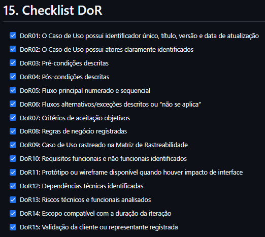

# UC01 - Gerenciar Atividades Educacionais

[Voltar para Itens de Trabalho](../backlog.md#102-casos-de-uso)

## 1. Atores

**Ator principal:** Professor

## 2. Objetivo

Permitir que usuários com perfil de professor criem, visualizem, editem, excluam e gerenciem atividades educacionais compostas por múltiplas questões, possibilitando posteriormente que usuários comuns acessem e respondam essas atividades na seção de prática do aplicativo.

## 3. Pré-condições

1. O ator deve estar autenticado no aplicativo.
2. O ator deve possuir perfil de professor.
3. O professor deve acessar a área de gestão de atividades pelo menu do aplicativo.
4. O sistema deve possuir mecanismo de controle de acesso por perfil de usuário.

## 4. Fluxo Principal

**Criar e listar atividade**

1. O professor acessa a seção de Gestão de Atividades.
2. O sistema valida se o usuário autenticado possui perfil de professor.
3. O sistema exibe a lista de atividades educacionais já cadastradas e associadas ao professor.
4. O professor aciona a opção de adicionar uma nova atividade.
5. O sistema apresenta o formulário de criação de atividade.
6. O professor informa o título da atividade.
7. O professor informa, opcionalmente, a descrição da atividade.
8. O professor adiciona uma ou mais questões à atividade.
9. Para cada questão, o professor informa o enunciado, as alternativas disponíveis e a alternativa correta.
10. Opcionalmente, o professor associa outros professores à atividade.
11. O professor confirma a criação da atividade.
12. O sistema valida os dados obrigatórios.
13. O sistema registra a atividade no banco de dados, associando-a ao professor criador.
14. O sistema marca a atividade como liberada quando os dados mínimos forem válidos.
15. O sistema retorna o professor para a lista de atividades.
16. O sistema exibe mensagem de sucesso informando que a atividade foi criada.

## 5. Fluxos Alternativos

**FA01 - Editar Atividade**

1. No passo 3 do fluxo principal, o professor seleciona uma atividade existente.
2. O sistema carrega os dados atuais da atividade.
3. O professor altera um ou mais campos da atividade, como título, descrição, questões, alternativas, alternativa correta ou professores associados.
4. O professor confirma a edição.
5. O sistema valida os dados alterados.
6. O sistema atualiza o registro da atividade no banco de dados.
7. O sistema atualiza a data de modificação.
8. O sistema retorna o professor para a lista de atividades.
9. O sistema exibe mensagem de sucesso informando que a atividade foi atualizada.

**FA02 - Visualizar Detalhes da Atividade**

1. No passo 3 do fluxo principal, o professor seleciona uma atividade cadastrada.
2. O sistema exibe os dados completos da atividade.
3. O sistema apresenta título, descrição, questões, alternativas, alternativa correta e professores associados.
4. O professor pode retornar à lista, editar ou excluir a atividade.

**FA03 - Excluir Atividade**

1. No passo 3 do fluxo principal, o professor seleciona uma atividade existente.
2. O professor aciona a opção de exclusão.
3. O sistema solicita confirmação da exclusão.
4. O professor confirma a exclusão.
5. O sistema remove a atividade do banco de dados ou altera seu status conforme a estratégia adotada pelo projeto.
6. O sistema retorna o professor para a lista de atividades.
7. O sistema exibe mensagem de sucesso informando que a atividade foi excluída.

**FA04 - Cancelar Criação ou Edição**

1. Durante a criação ou edição da atividade, o professor aciona a opção de cancelar ou voltar.
2. O sistema descarta alterações não salvas.
3. O sistema retorna o professor à lista de atividades.
4. Nenhum dado é registrado ou alterado no banco de dados.

## 6. Fluxos de Exceção

**FE01 - Usuário sem Permissão**

1. O usuário tenta acessar a gestão de atividades sem possuir perfil de professor.
2. O sistema identifica que o perfil do usuário não possui permissão.
3. O sistema bloqueia o acesso à funcionalidade.
4. O sistema exibe mensagem informando que apenas professores podem gerenciar atividades.

**FE02 - Dados Obrigatórios Ausentes**

1. O professor tenta criar ou editar uma atividade sem preencher campos obrigatórios.
2. O sistema identifica a ausência de dados obrigatórios.
3. O sistema impede o salvamento da atividade.
4. O sistema destaca os campos inválidos.
5. O sistema orienta o professor a preencher as informações necessárias.

Campos obrigatórios mínimos:

- título;
- pelo menos uma questão;
- enunciado da questão;
- pelo menos duas alternativas;
- uma alternativa correta valida.

**FE03 - Alternativa Correta Inválida**

1. O professor informa uma alternativa correta inexistente ou incompatível com a lista de alternativas.
2. O sistema identifica a inconsistência.
3. O sistema impede o salvamento da atividade.
4. O sistema exibe mensagem informando que a alternativa correta deve corresponder a uma das alternativas cadastradas.

**FE04 - Falha de Conectividade**

1. O professor tenta criar, editar ou excluir uma atividade sem conexão com o backend.
2. O sistema não consegue concluir a operação.
3. O sistema exibe mensagem de falha de conexão.
4. O sistema mantém os dados preenchidos na tela enquanto possível.
5. O sistema orienta o professor a tentar novamente quando a conexão for restabelecida.

**FE05 - Erro Interno no Banco de Dados**

1. O professor confirma uma operação válida.
2. O sistema tenta registrar, atualizar ou excluir a atividade no banco de dados.
3. O banco de dados retorna erro ou indisponibilidade.
4. O sistema cancela a operação.
5. O sistema exibe mensagem de erro interno.
6. O sistema não deve apresentar a operação como concluída sem confirmação do backend.

## 7. Regras de Negócio

> Espaço reservado para inserir as regras de negócio definitivas da UC01.

## 8. Requisitos Relacionados

| RF | Relacao com a UC |
| :--- | :--- |
| **RF01 - Criar atividade educacional** | Relaciona-se aos passos 4 a 16 do fluxo principal, nos quais o professor acessa o formulário, preenche os dados da atividade e confirma sua criação. |
| **RF02 - Listar atividades educacionais** | Relaciona-se aos passos 1 a 3 do fluxo principal, nos quais o sistema exibe ao professor a lista de atividades já cadastradas e associadas a ele. |
| **RF03 - Visualizar detalhes da atividade** | Relaciona-se ao fluxo alternativo FA02, no qual o professor seleciona uma atividade e visualiza seus dados completos. |
| **RF04 - Validar dados obrigatórios da atividade** | Relaciona-se aos passos 12 a 14 do fluxo principal e aos fluxos de exceção FE02 e FE03. |
| **RF05 - Editar atividade educacional** | Relaciona-se ao fluxo alternativo FA01, no qual o professor altera os dados de uma atividade existente. |
| **RF06 - Excluir atividade educacional** | Relaciona-se ao fluxo alternativo FA03, no qual o professor solicita e confirma a exclusão de uma atividade. |
| **RF07 - Associar professores à atividade** | Relaciona-se ao passo 10 do fluxo principal e ao fluxo de edição. |
| **RF08 - Controlar acesso da funcionalidade por perfil de usuário** | Relaciona-se ao passo 2 do fluxo principal e ao fluxo de exceção FE01. |

## 9. Protótipo

> Espaço reservado para adicionar prints das telas, imagens do protótipo e link do Figma.

**Link do Figma:** _adicionar aqui_

## 10. Definition of Ready

Esta seção registra o checklist de Definition of Ready utilizado para validar a UC01.

**Issue do DoR:** [Checklist DoR da UC01](https://github.com/mdsreq-fga-unb/REQ-2026.1-T02-Nativo/issues/22)

**Print do checklist DoR:**

## 11. Fluxo de Acesso à UC

> Espaço reservado para adicionar o fluxo de como chegar nesta UC dentro do sistema, com prints reais das telas.
