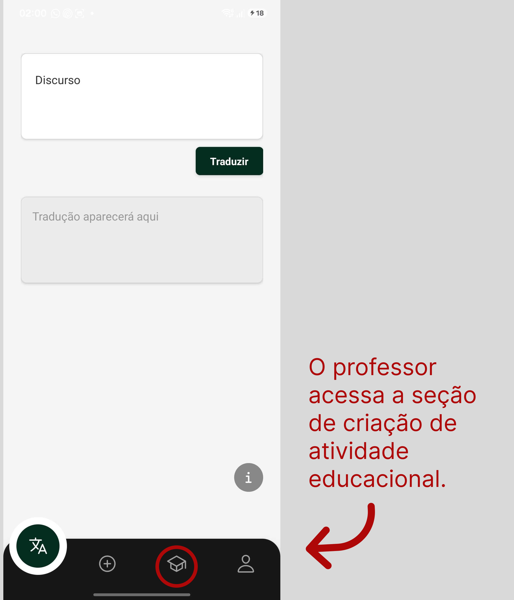
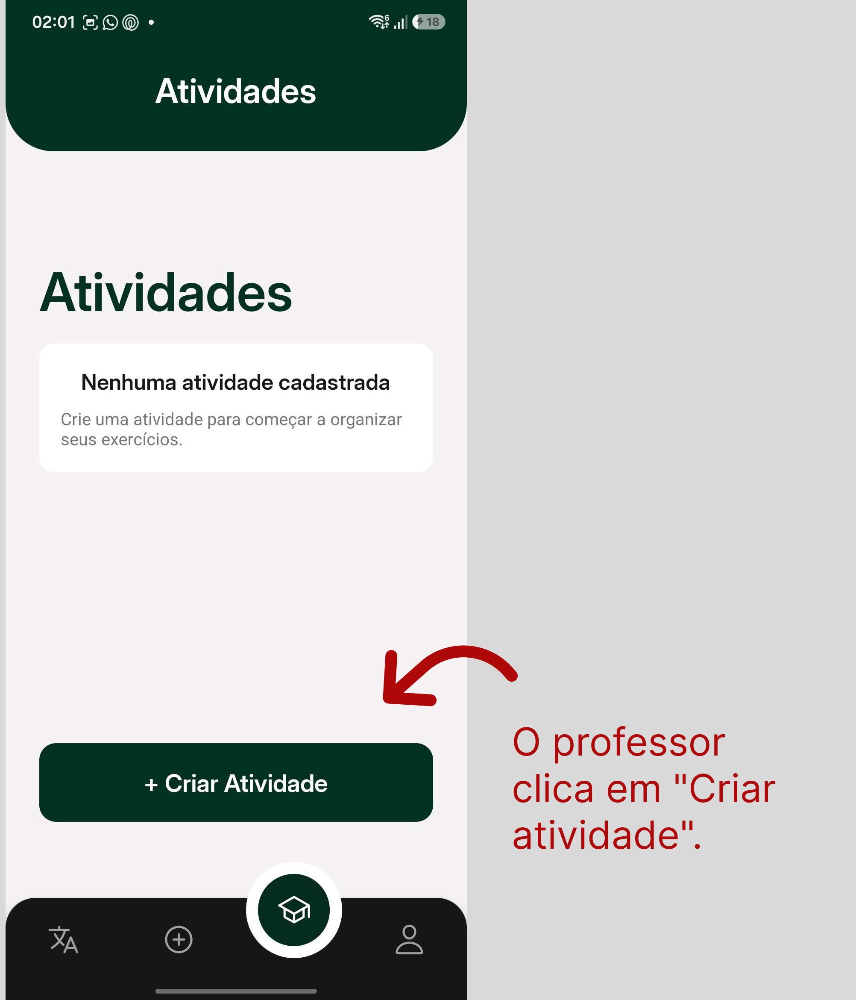
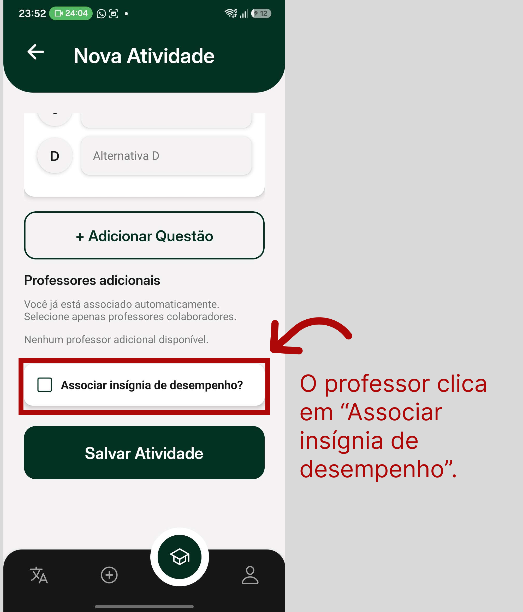
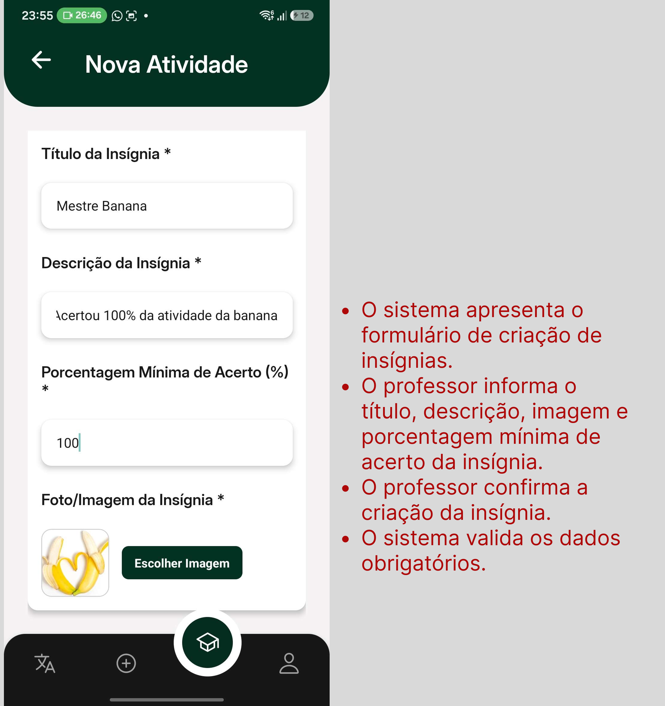

# UC03 - Gerenciar Insígnias

[Voltar para Casos de Uso](../backlog.md#9-casos-de-uso)

## 1. Atores

**Atores principais:** Professor, Administrador

## 2. Objetivo

Permitir que professores e administradores criem, visualizem, editem e excluam insígnias personalizadas utilizadas na plataforma.

## 3. Pré-condições

1. O ator deve estar autenticado no aplicativo.
2. O ator deve possuir perfil de professor ou administrador.
3. O ator deve acessar a página de gerenciamento de insígnias.
4. O sistema deve possuir conexão ativa com o backend.
5. O backend deve estar integrado ao banco de dados Firebase/Firestore.

## 4. Fluxo Principal

**FP01 - Criar Insígnia**

1. O professor ou administrador acessa a seção de criação de insígnias. ([RF07](#uc03-rf07))
2. O sistema identifica o perfil do ator autenticado. ([RF07](#uc03-rf07))
3. O sistema valida se o ator possui permissão para criar insígnias. ([RF07](#uc03-rf07))
4. O sistema apresenta o formulário de criação de insígnias. ([RF07](#uc03-rf07))
5. O ator informa o título da insígnia. ([RF07](#uc03-rf07))
6. O ator informa a descrição da insígnia. ([RF07](#uc03-rf07))
7. O ator adiciona a imagem da insígnia. ([RF07](#uc03-rf07))
8. O ator informa a porcentagem mínima de acerto para obtenção da insígnia. ([RF07](#uc03-rf07))
9. O ator confirma a criação da insígnia. ([RF07](#uc03-rf07))
10. O sistema valida os dados obrigatórios. ([RF07](#uc03-rf07))
11. O sistema registra a insígnia no banco de dados. ([RF07](#uc03-rf07))
12. O sistema disponibiliza a insígnia para uso na plataforma. ([RF07](#uc03-rf07))
13. O sistema exibe mensagem de sucesso informando que a insígnia foi criada. ([RF07](#uc03-rf07))

## 5. Fluxos Alternativos

**FA01 - Listar Insígnias**

1. O professor ou administrador acessa a página de insígnias. ([RF08](#uc03-rf08))
2. O sistema identifica o perfil do ator autenticado. ([RF08](#uc03-rf08))
3. O sistema busca as insígnias cadastradas. ([RF08](#uc03-rf08))
4. O sistema exibe a lista de insígnias disponíveis. ([RF08](#uc03-rf08))
5. O ator visualiza as insígnias cadastradas. ([RF08](#uc03-rf08))

**FA02 - Editar Insígnia**

1. O professor ou administrador acessa a lista de insígnias. ([RF08](#uc03-rf08))
2. O ator seleciona uma insígnia existente. ([RF08](#uc03-rf08))
3. O sistema carrega os dados atuais da insígnia. ([RF08](#uc03-rf08))
4. O ator altera o título, a descrição, a imagem e/ou a porcentagem mínima. ([RF08](#uc03-rf08))
5. O ator confirma a edição da insígnia. ([RF08](#uc03-rf08))
6. O sistema valida os dados alterados. ([RF08](#uc03-rf08))
7. O sistema atualiza a insígnia no banco de dados. ([RF08](#uc03-rf08))
8. O sistema exibe mensagem de sucesso informando que a insígnia foi atualizada. ([RF08](#uc03-rf08))

**FA03 - Excluir Insígnia**

1. O professor ou administrador acessa a lista de insígnias. ([RF09](#uc03-rf09))
2. O ator seleciona uma insígnia existente. ([RF09](#uc03-rf09))
3. O ator aciona a opção de exclusão. ([RF09](#uc03-rf09))
4. O sistema solicita confirmação da exclusão. ([RF09](#uc03-rf09))
5. O ator confirma a exclusão. ([RF09](#uc03-rf09))
6. O sistema remove a insígnia do banco de dados ou altera seu status para indisponível. ([RF09](#uc03-rf09))
7. O sistema exibe mensagem de sucesso informando que a insígnia foi excluída. ([RF09](#uc03-rf09))

**FA04 - Cancelar Criação ou Edição**

1. Durante a criação ou edição da insígnia, o ator aciona a opção de cancelar ou voltar. ([RF07](#uc03-rf07), [RF08](#uc03-rf08))
2. O sistema descarta as alterações não salvas. ([RF07](#uc03-rf07), [RF08](#uc03-rf08))
3. O sistema retorna o ator para a tela anterior. ([RF07](#uc03-rf07), [RF08](#uc03-rf08))
4. Nenhum dado é registrado ou alterado no banco de dados. ([RF07](#uc03-rf07), [RF08](#uc03-rf08))

## 6. Fluxos de Exceção

**FE01 - Interface Indisponível para o Perfil do Ator**

1. O professor ou administrador acessa o aplicativo autenticado. ([RF07](#uc03-rf07), [RF08](#uc03-rf08), [RF09](#uc03-rf09))
2. O sistema identifica o perfil do ator autenticado. ([RF07](#uc03-rf07), [RF08](#uc03-rf08), [RF09](#uc03-rf09))
3. O sistema exibe apenas as interfaces e ações permitidas para aquele perfil. ([RF07](#uc03-rf07), [RF08](#uc03-rf08), [RF09](#uc03-rf09))
4. Caso o perfil não possua permissão para determinada ação, a opção correspondente não é exibida na interface. ([RF07](#uc03-rf07), [RF08](#uc03-rf08), [RF09](#uc03-rf09))

**FE02 - Dados Obrigatórios Ausentes**

1. O ator tenta criar ou editar uma insígnia sem preencher os campos obrigatórios. ([RF07](#uc03-rf07), [RF08](#uc03-rf08))
2. O sistema identifica a ausência de dados obrigatórios. ([RF07](#uc03-rf07), [RF08](#uc03-rf08))
3. O sistema impede o salvamento da insígnia. ([RF07](#uc03-rf07), [RF08](#uc03-rf08))
4. O sistema destaca os campos inválidos. ([RF07](#uc03-rf07), [RF08](#uc03-rf08))
5. O sistema orienta o ator a preencher as informações necessárias. ([RF07](#uc03-rf07), [RF08](#uc03-rf08))

Campos obrigatórios mínimos:

- título;
- descrição;
- imagem;
- porcentagem mínima de acerto.

**FE03 - Porcentagem Mínima Inválida**

1. O ator informa uma porcentagem mínima inválida durante a criação ou edição da insígnia. ([RF07](#uc03-rf07), [RF08](#uc03-rf08))
2. O sistema identifica a inconsistência. ([RF07](#uc03-rf07), [RF08](#uc03-rf08))
3. O sistema impede o salvamento da insígnia. ([RF07](#uc03-rf07), [RF08](#uc03-rf08))
4. O sistema exibe mensagem informando que a porcentagem mínima deve estar entre 0 e 100. ([RF07](#uc03-rf07), [RF08](#uc03-rf08))

**FE04 - Insígnia Indisponível por Estado Desatualizado**

1. O professor ou administrador visualiza uma insígnia antes da atualização completa do estado no banco de dados. ([RF08](#uc03-rf08), [RF09](#uc03-rf09))
2. O ator tenta editar ou excluir a insígnia. ([RF08](#uc03-rf08), [RF09](#uc03-rf09))
3. O sistema revalida a disponibilidade da insígnia no backend. ([RF08](#uc03-rf08), [RF09](#uc03-rf09))
4. O sistema identifica que a insígnia foi removida ou tornou-se indisponível. ([RF08](#uc03-rf08), [RF09](#uc03-rf09))
5. O sistema impede a operação solicitada. ([RF08](#uc03-rf08), [RF09](#uc03-rf09))
6. O sistema atualiza a lista de insígnias disponíveis. ([RF08](#uc03-rf08))
7. O sistema informa que a insígnia não está mais disponível para a operação solicitada. ([RF08](#uc03-rf08), [RF09](#uc03-rf09))

**FE05 - Falha de Conectividade**

1. O ator tenta criar, listar, editar ou excluir uma insígnia sem conexão com o backend. ([RF07](#uc03-rf07), [RF08](#uc03-rf08), [RF09](#uc03-rf09))
2. O sistema não consegue concluir a operação. ([RF07](#uc03-rf07), [RF08](#uc03-rf08), [RF09](#uc03-rf09))
3. O sistema exibe mensagem de falha de conexão. ([RF07](#uc03-rf07), [RF08](#uc03-rf08), [RF09](#uc03-rf09))
4. O sistema orienta o ator a tentar novamente quando a conexão for restabelecida. ([RF07](#uc03-rf07), [RF08](#uc03-rf08), [RF09](#uc03-rf09))

**FE06 - Erro Interno no Banco de Dados**

1. O ator confirma uma operação válida envolvendo uma insígnia. ([RF07](#uc03-rf07), [RF08](#uc03-rf08), [RF09](#uc03-rf09))
2. O sistema tenta registrar, atualizar, excluir ou consultar dados no Firestore. ([RF07](#uc03-rf07), [RF08](#uc03-rf08), [RF09](#uc03-rf09))
3. O banco de dados retorna erro ou indisponibilidade. ([RF07](#uc03-rf07), [RF08](#uc03-rf08), [RF09](#uc03-rf09))
4. O sistema cancela a operação. ([RF07](#uc03-rf07), [RF08](#uc03-rf08), [RF09](#uc03-rf09))
5. O sistema exibe mensagem de erro interno. ([RF07](#uc03-rf07), [RF08](#uc03-rf08), [RF09](#uc03-rf09))

## 7. Regras de Negócio

- [RN06 - Campos obrigatórios para registro de entidades](../requisitos.md#req-rn06)
- [RN07 - Dependência entre insígnias de acerto e atividade removida](../requisitos.md#req-rn07)

## 8. Requisitos Relacionados

| RF | Relação com a UC |
| :--- | :--- |
| [**RF07 - Criar insígnia**](../requisitos.md#req-rf07) | Permite que professores e administradores criem insígnias personalizadas. |
| [**RF08 - Editar insígnia**](../requisitos.md#req-rf08) | Permite que professores e administradores visualizem e editem insígnias. |
| [**RF09 - Excluir insígnias**](../requisitos.md#req-rf09) | Permite que professores e administradores excluam insígnias. |

## 9. Protótipo

> Espaço reservado para adicionar prints das telas, imagens do protótipo e link do Figma.

**Link do Figma:** [Figma](https://www.figma.com/design/uTKEQkRbmnBttLtu5jbt1w/Nativo?node-id=18-477&t=D7Xf5gRy0B9D4pv3-1)

## 10. Definition of Ready

Esta seção registra o print do checklist de Definition of Ready utilizado para validar a UC03.

**Aplicação do DoR:** [Issue Uc03](https://github.com/mdsreq-fga-unb/REQ-2026.1-T02-Nativo/issues/24)

**Print do checklist DoR:**

## 11. Fluxo de Acesso à UC

---

[Próxima: UC04 - Gerenciar Feed Social](uc04.md)
