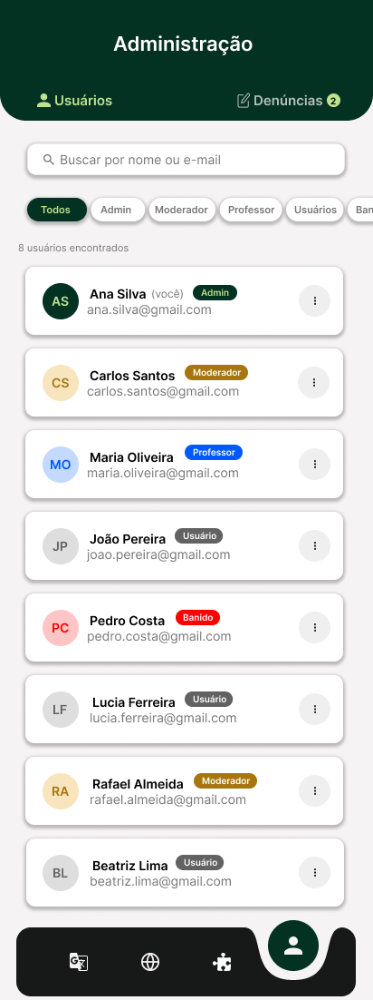
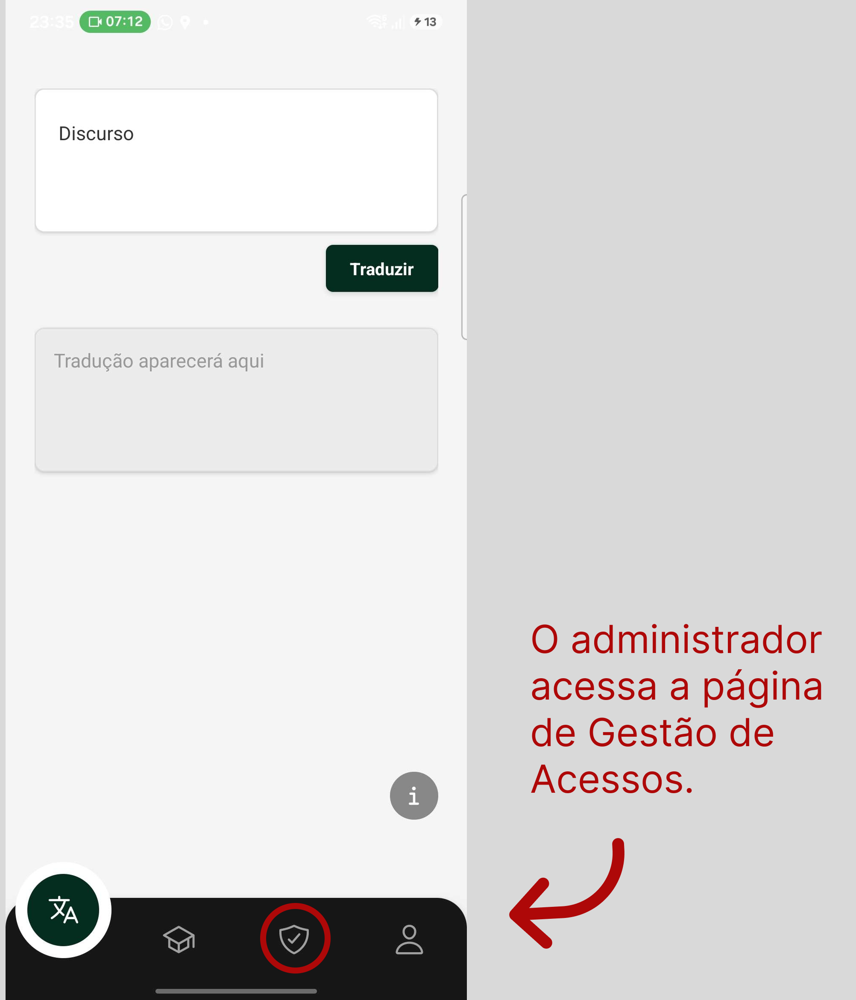
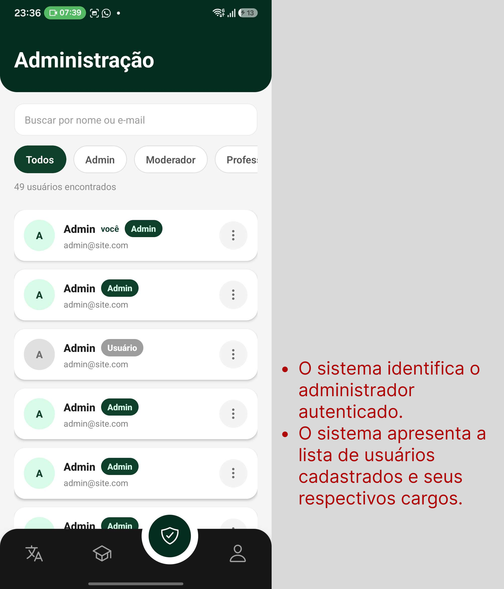
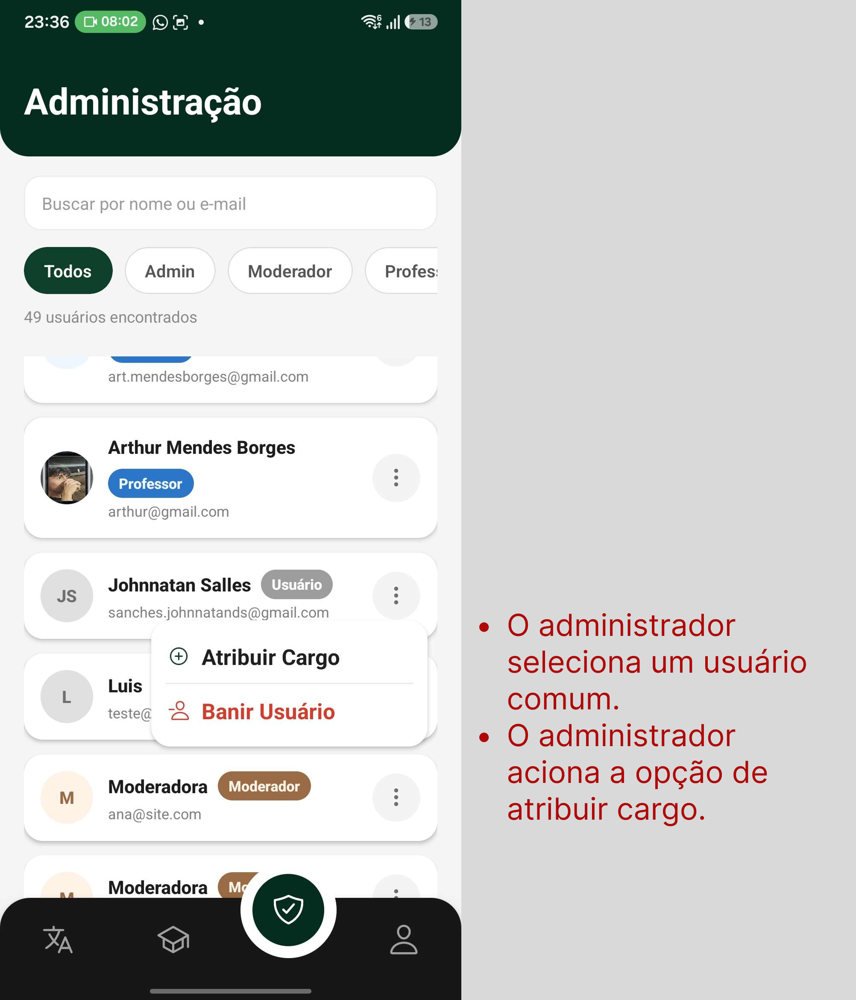
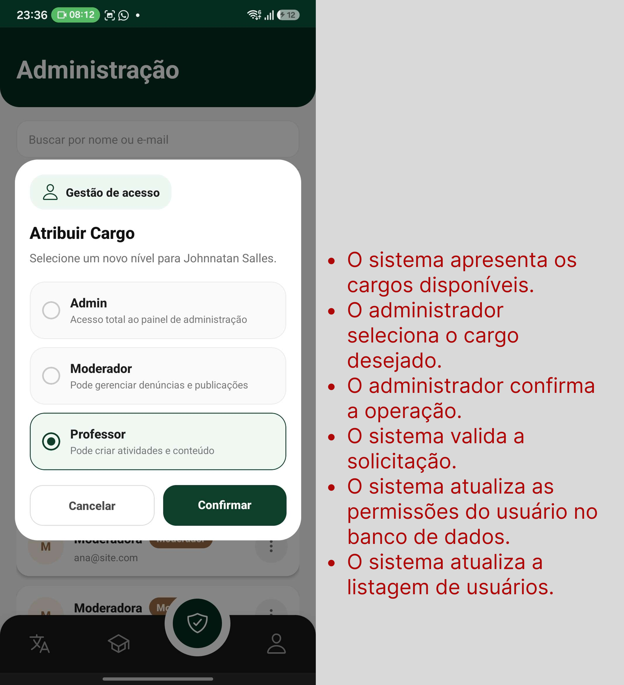

# UC06 - Gerenciar Acessos e Permissões

[Voltar para Casos de Uso](../backlog.md#9-casos-de-uso)

## 1. Atores

**Atores principais:** Administrador

## 2. Objetivo

Permitir que administradores gerenciem os níveis de acesso dos usuários, atribuindo, alterando, revogando cargos e banindo usuários da plataforma.

## 3. Pré-condições

1. O ator deve estar autenticado no aplicativo.
2. O ator deve possuir perfil de administrador.
3. O ator deve acessar a página de Gestão de Acessos.
4. O sistema deve possuir conexão ativa com o backend.
5. O backend deve estar integrado ao banco de dados Firebase/Firestore.

## 4. Fluxo Principal

**FP01 - Atribuir Cargo ao Usuário**

1. O administrador acessa a página de Gestão de Acessos. ([RF23](#uc06-rf23))
2. O sistema identifica o administrador autenticado. ([RF23](#uc06-rf23))
3. O sistema apresenta a lista de usuários cadastrados e seus respectivos cargos. ([RF23](#uc06-rf23))
4. O administrador seleciona um usuário comum. ([RF21](#uc06-rf21))
5. O administrador aciona a opção de atribuir cargo. ([RF21](#uc06-rf21))
6. O sistema apresenta os cargos disponíveis. ([RF21](#uc06-rf21))
7. O administrador seleciona o cargo desejado. ([RF21](#uc06-rf21))
8. O administrador confirma a operação. ([RF21](#uc06-rf21))
9. O sistema valida a solicitação. ([RF21](#uc06-rf21))
10. O sistema atualiza as permissões do usuário no banco de dados. ([RF21](#uc06-rf21))
11. O sistema atualiza a listagem de usuários. ([RF21](#uc06-rf21), [RF23](#uc06-rf23))
12. O sistema exibe mensagem de sucesso informando que o cargo foi atribuído. ([RF21](#uc06-rf21))

## 5. Fluxos Alternativos

**FA01 - Listar Usuários**

1. O administrador acessa a página de Gestão de Acessos. ([RF23](#uc06-rf23))
2. O sistema busca os usuários cadastrados. ([RF23](#uc06-rf23))
3. O sistema exibe os usuários e seus respectivos níveis de acesso. ([RF23](#uc06-rf23))
4. O administrador visualiza as informações. ([RF23](#uc06-rf23))

**FA02 - Alterar Cargo de Usuário**

1. O administrador seleciona um usuário que já possui um cargo. ([RF22](#uc06-rf22))
2. O administrador aciona a opção de alterar permissões. ([RF22](#uc06-rf22))
3. O sistema apresenta os cargos disponíveis. ([RF22](#uc06-rf22))
4. O administrador seleciona o novo cargo. ([RF22](#uc06-rf22))
5. O administrador confirma a alteração. ([RF22](#uc06-rf22))
6. O sistema valida a solicitação. ([RF22](#uc06-rf22))
7. O sistema atualiza as permissões do usuário. ([RF22](#uc06-rf22))
8. O sistema exibe mensagem de sucesso informando que o cargo foi alterado. ([RF22](#uc06-rf22))

**FA03 - Revogar Cargo Especial**

1. O administrador seleciona um usuário que possui um cargo especial. ([RF24](#uc06-rf24))
2. O administrador aciona a opção de revogar privilégios. ([RF24](#uc06-rf24))
3. O sistema solicita confirmação da operação. ([RF24](#uc06-rf24))
4. O administrador confirma a revogação. ([RF24](#uc06-rf24))
5. O sistema altera o usuário para o nível de usuário comum. ([RF24](#uc06-rf24))
6. O sistema atualiza a listagem de usuários. ([RF24](#uc06-rf24), [RF23](#uc06-rf23))
7. O sistema exibe mensagem de sucesso informando que o cargo foi revogado. ([RF24](#uc06-rf24))

**FA04 - Banir Usuário**

1. O administrador seleciona um usuário. ([RF20](#uc06-rf20))
2. O administrador aciona a opção de banimento. ([RF20](#uc06-rf20))
3. O sistema solicita confirmação da operação. ([RF20](#uc06-rf20))
4. O administrador confirma o banimento. ([RF20](#uc06-rf20))
5. O sistema inativa a conta do usuário. ([RF20](#uc06-rf20))
6. O sistema impede novos acessos utilizando aquela conta. ([RF20](#uc06-rf20))
7. O sistema atualiza a listagem de usuários. ([RF20](#uc06-rf20), [RF23](#uc06-rf23))
8. O sistema exibe mensagem de sucesso informando que o usuário foi banido. ([RF20](#uc06-rf20))

**FA05 - Cancelar Operação**

1. Durante qualquer operação de gerenciamento de permissões, o administrador aciona a opção de cancelar ou voltar. ([RF20](#uc06-rf20), [RF21](#uc06-rf21), [RF22](#uc06-rf22), [RF24](#uc06-rf24))
2. O sistema descarta as alterações não salvas. ([RF20](#uc06-rf20), [RF21](#uc06-rf21), [RF22](#uc06-rf22), [RF24](#uc06-rf24))
3. O sistema retorna para a tela anterior. ([RF20](#uc06-rf20), [RF21](#uc06-rf21), [RF22](#uc06-rf22), [RF24](#uc06-rf24))
4. Nenhuma alteração é realizada no banco de dados. ([RF20](#uc06-rf20), [RF21](#uc06-rf21), [RF22](#uc06-rf22), [RF24](#uc06-rf24))

## 6. Fluxos de Exceção

**FE01 - Usuário Não Possui Permissão Administrativa**

1. Um usuário sem perfil de administrador tenta acessar a Gestão de Acessos. ([RF20](#uc06-rf20), [RF21](#uc06-rf21), [RF22](#uc06-rf22), [RF23](#uc06-rf23), [RF24](#uc06-rf24))
2. O sistema identifica a ausência de permissões administrativas. ([RF20](#uc06-rf20), [RF21](#uc06-rf21), [RF22](#uc06-rf22), [RF23](#uc06-rf23), [RF24](#uc06-rf24))
3. O sistema bloqueia o acesso à funcionalidade. ([RF20](#uc06-rf20), [RF21](#uc06-rf21), [RF22](#uc06-rf22), [RF23](#uc06-rf23), [RF24](#uc06-rf24))
4. O sistema informa que o acesso é restrito a administradores. ([RF20](#uc06-rf20), [RF21](#uc06-rf21), [RF22](#uc06-rf22), [RF23](#uc06-rf23), [RF24](#uc06-rf24))

**FE02 - Auto-Bloqueio Administrativo**

1. O administrador tenta banir sua própria conta ou remover seu próprio cargo administrativo. ([RF20](#uc06-rf20), [RF24](#uc06-rf24))
2. O sistema identifica a tentativa de auto-bloqueio. ([RF20](#uc06-rf20), [RF24](#uc06-rf24))
3. O sistema verifica se existe outro administrador ativo. ([RF20](#uc06-rf20), [RF24](#uc06-rf24))
4. Caso não exista outro administrador, o sistema impede a operação. ([RF20](#uc06-rf20), [RF24](#uc06-rf24))
5. O sistema informa que a plataforma deve possuir pelo menos um administrador ativo. ([RF20](#uc06-rf20), [RF24](#uc06-rf24))

**FE03 - Usuário Indisponível**

1. O administrador tenta alterar, revogar ou banir um usuário. ([RF20](#uc06-rf20), [RF22](#uc06-rf22), [RF24](#uc06-rf24))
2. O sistema verifica a existência do usuário. ([RF20](#uc06-rf20), [RF22](#uc06-rf22), [RF24](#uc06-rf24))
3. O sistema identifica que o usuário foi removido ou encontra-se indisponível. ([RF20](#uc06-rf20), [RF22](#uc06-rf22), [RF24](#uc06-rf24))
4. O sistema impede a operação. ([RF20](#uc06-rf20), [RF22](#uc06-rf22), [RF24](#uc06-rf24))
5. O sistema atualiza a listagem de usuários. ([RF23](#uc06-rf23))

**FE04 - Falha de Conectividade**

1. O administrador tenta executar uma operação sem conexão com o backend. ([RF20](#uc06-rf20), [RF21](#uc06-rf21), [RF22](#uc06-rf22), [RF23](#uc06-rf23), [RF24](#uc06-rf24))
2. O sistema não consegue concluir a operação. ([RF20](#uc06-rf20), [RF21](#uc06-rf21), [RF22](#uc06-rf22), [RF23](#uc06-rf23), [RF24](#uc06-rf24))
3. O sistema exibe mensagem de falha de conexão. ([RF20](#uc06-rf20), [RF21](#uc06-rf21), [RF22](#uc06-rf22), [RF23](#uc06-rf23), [RF24](#uc06-rf24))
4. O sistema orienta o administrador a tentar novamente quando a conexão for restabelecida. ([RF20](#uc06-rf20), [RF21](#uc06-rf21), [RF22](#uc06-rf22), [RF23](#uc06-rf23), [RF24](#uc06-rf24))

**FE05 - Erro Interno no Banco de Dados**

1. O administrador confirma uma operação válida de gerenciamento de acessos. ([RF20](#uc06-rf20), [RF21](#uc06-rf21), [RF22](#uc06-rf22), [RF23](#uc06-rf23), [RF24](#uc06-rf24))
2. O sistema tenta registrar, atualizar ou consultar dados no Firestore. ([RF20](#uc06-rf20), [RF21](#uc06-rf21), [RF22](#uc06-rf22), [RF23](#uc06-rf23), [RF24](#uc06-rf24))
3. O banco de dados retorna erro ou indisponibilidade. ([RF20](#uc06-rf20), [RF21](#uc06-rf21), [RF22](#uc06-rf22), [RF23](#uc06-rf23), [RF24](#uc06-rf24))
4. O sistema cancela a operação. ([RF20](#uc06-rf20), [RF21](#uc06-rf21), [RF22](#uc06-rf22), [RF23](#uc06-rf23), [RF24](#uc06-rf24))
5. O sistema exibe mensagem de erro interno. ([RF20](#uc06-rf20), [RF21](#uc06-rf21), [RF22](#uc06-rf22), [RF23](#uc06-rf23), [RF24](#uc06-rf24))

## 7. Regras de Negócio

- [RN11 - Efeito imediato de alteração de acesso e banimento reversível](../requisitos.md#req-rn11)
- [RN12 - Bloqueio de autoexclusão ou autobanimento do último Administrador](../requisitos.md#req-rn12)

## 8. Requisitos Relacionados

| RF | Relação com a UC |
| :--- | :--- |
| [**RF20 - Banir usuário**](../requisitos.md#req-rf20) | Permite que administradores banam usuários infratores da aplicação. |
| [**RF21 - Atribuir cargos de usuário**](../requisitos.md#req-rf21) | Permite que administradores atribuam permissões específicas aos usuários. |
| [**RF22 - Editar cargos de usuário**](../requisitos.md#req-rf22) | Permite que administradores modifiquem os níveis de acesso de um usuário existente. |
| [**RF23 - Listar cargos de usuário**](../requisitos.md#req-rf23) | Permite que administradores visualizem os cargos disponíveis e quem os ocupa. |
| [**RF24 - Desatribuir cargos de usuário**](../requisitos.md#req-rf24) | Permite que administradores removam um cargo atribuído a um usuário. |

## 9. Protótipo

{ width=250px }

**Link do Figma:** [Figma](https://www.figma.com/design/uTKEQkRbmnBttLtu5jbt1w/Nativo?node-id=18-477&t=D7Xf5gRy0B9D4pv3-1)

## 10. Aplicação do DoR

**Aplicação do DoR:** [Issue Uc06](https://github.com/mdsreq-fga-unb/REQ-2026.1-T02-Nativo/issues/27)

**Print do checklist DoR:**

## 11. Fluxo de Acesso à UC

{ width=250px }
{ width=250px }
{ width=250px }
{ width=250px }

---

[Próxima: UC07 - Redefinir Senha de Acesso](uc07.md)
