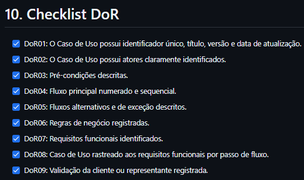

# UC07 - Redefinir Senha de Acesso

[Voltar para Casos de Uso](../backlog.md#9-casos-de-uso)

## 1. Atores

**Atores principais:** Usuário não autenticado

## 2. Objetivo

Permitir que usuários recuperem o acesso à conta por meio da redefinição da senha utilizando um código de verificação enviado para o e-mail cadastrado.

## 3. Pré-condições

1. O ator deve possuir uma conta cadastrada na plataforma.
2. O ator deve acessar a tela de login.
3. O sistema deve possuir conexão ativa com o backend.
4. O serviço de envio de e-mails deve estar disponível.
5. O backend deve estar integrado ao banco de dados Firebase/Firestore.

## 4. Fluxo Principal

**FP01 - Recuperar Senha**

1. O usuário acessa a tela de login. ([RF26](#uc07-rf26))
2. O usuário seleciona a opção "Esqueci minha senha". ([RF26](#uc07-rf26))
3. O sistema apresenta o formulário de recuperação de senha. ([RF26](#uc07-rf26))
4. O usuário informa o e-mail vinculado à conta. ([RF26](#uc07-rf26))
5. O usuário confirma a solicitação. ([RF26](#uc07-rf26))
6. O sistema verifica a solicitação e gera um código de recuperação. ([RF26](#uc07-rf26))
7. O sistema envia o código para o e-mail informado. ([RF26](#uc07-rf26))
8. O sistema apresenta a tela para validação do código e definição da nova senha. ([RF26](#uc07-rf26))
9. O usuário informa o código recebido, a nova senha e sua confirmação. ([RF26](#uc07-rf26))
10. O sistema valida o código e as informações fornecidas. ([RF26](#uc07-rf26))
11. O sistema criptografa a nova senha e atualiza o registro do usuário no banco de dados. ([RF26](#uc07-rf26))
12. O sistema exibe mensagem de sucesso informando que a senha foi redefinida. ([RF26](#uc07-rf26))
13. O sistema redireciona o usuário para a tela de login. ([RF26](#uc07-rf26))

## 5. Fluxos Alternativos

**FA01 - Reenviar Código de Recuperação**

1. O usuário solicita o reenvio do código de recuperação. ([RF26](#uc07-rf26))
2. O sistema verifica se o tempo mínimo para reenvio foi atingido. ([RF26](#uc07-rf26))
3. O sistema invalida o código anterior. ([RF26](#uc07-rf26))
4. O sistema gera um novo código de recuperação. ([RF26](#uc07-rf26))
5. O sistema envia o novo código para o e-mail informado. ([RF26](#uc07-rf26))
6. O fluxo retorna ao passo 9 do Fluxo Principal. ([RF26](#uc07-rf26))

**FA02 - Cancelar Recuperação**

1. Durante o processo de recuperação, o usuário seleciona a opção de cancelar ou voltar. ([RF26](#uc07-rf26))
2. O sistema encerra o processo de recuperação. ([RF26](#uc07-rf26))
3. O sistema retorna o usuário para a tela de login. ([RF26](#uc07-rf26))

## 6. Fluxos de Exceção

**FE01 - E-mail Não Encontrado**

1. O usuário informa um e-mail para recuperação. ([RF26](#uc07-rf26))
2. O sistema verifica a solicitação. ([RF26](#uc07-rf26))
3. O sistema exibe uma mensagem genérica informando que, caso o e-mail esteja cadastrado, um código de recuperação será enviado. ([RF26](#uc07-rf26))
4. O sistema não informa se o e-mail existe ou não na base de usuários. ([RF26](#uc07-rf26))

**FE02 - Código Inválido ou Expirado**

1. O usuário informa um código inválido ou expirado. ([RF26](#uc07-rf26))
2. O sistema identifica a inconsistência. ([RF26](#uc07-rf26))
3. O sistema impede a redefinição da senha. ([RF26](#uc07-rf26))
4. O sistema informa que o código é inválido ou expirou. ([RF26](#uc07-rf26))
5. O sistema orienta o usuário a solicitar um novo código. ([RF26](#uc07-rf26))

**FE03 - Senhas Não Coincidem**

1. O usuário informa senhas diferentes nos campos de nova senha e confirmação. ([RF26](#uc07-rf26))
2. O sistema identifica a inconsistência. ([RF26](#uc07-rf26))
3. O sistema impede a atualização da senha. ([RF26](#uc07-rf26))
4. O sistema destaca os campos incorretos. ([RF26](#uc07-rf26))
5. O sistema solicita que as senhas sejam informadas novamente. ([RF26](#uc07-rf26))

**FE04 - Falha no Envio do E-mail**

1. O sistema tenta enviar o código de recuperação. ([RF26](#uc07-rf26))
2. O serviço de e-mail retorna erro ou indisponibilidade. ([RF26](#uc07-rf26))
3. O sistema interrompe o envio do código. ([RF26](#uc07-rf26))
4. O sistema informa que não foi possível enviar o e-mail no momento. ([RF26](#uc07-rf26))
5. O sistema orienta o usuário a tentar novamente mais tarde. ([RF26](#uc07-rf26))

**FE05 - Falha de Conectividade**

1. O usuário tenta recuperar a senha sem conexão com o backend. ([RF26](#uc07-rf26))
2. O sistema não consegue concluir a operação. ([RF26](#uc07-rf26))
3. O sistema exibe mensagem de falha de conexão. ([RF26](#uc07-rf26))
4. O sistema orienta o usuário a tentar novamente quando a conexão for restabelecida. ([RF26](#uc07-rf26))

**FE06 - Erro Interno no Banco de Dados**

1. O sistema tenta validar ou atualizar os dados da recuperação de senha. ([RF26](#uc07-rf26))
2. O banco de dados retorna erro ou indisponibilidade. ([RF26](#uc07-rf26))
3. O sistema cancela a operação. ([RF26](#uc07-rf26))
4. O sistema exibe mensagem de erro interno. ([RF26](#uc07-rf26))

## 7. Regras de Negócio

> Espaço reservado para inserir as regras de negócio definitivas da UC07.

## 8. Requisitos Relacionados

| RF | Relação com a UC |
| :--- | :--- |
| [**RF26 - Recuperar senha**](../requisitos.md#req-rf26) | Permite que o usuário recupere o acesso à sua conta via redefinição de senha por e-mail. |

## 9. Protótipo

> Espaço reservado para adicionar prints das telas, imagens do protótipo e link do Figma.

**Link do Figma:** _adicionar aqui_

## 10. Aplicação do DoR

**Aplicação do DoR:** [Issue Uc07](https://github.com/mdsreq-fga-unb/REQ-2026.1-T02-Nativo/issues/28)

**Print do checklist DoR:**

## 11. Fluxo de Acesso à UC

> Espaço reservado para adicionar o fluxo de como chegar nesta UC dentro do sistema, com prints reais das telas.

---

[Próxima: UC08 - Gerenciar Moderação de Conteúdo](uc08.md)
