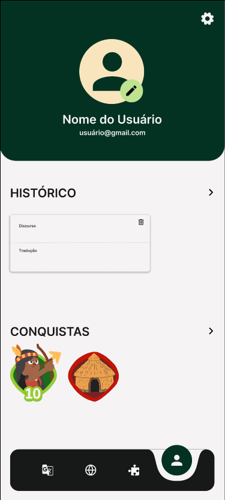
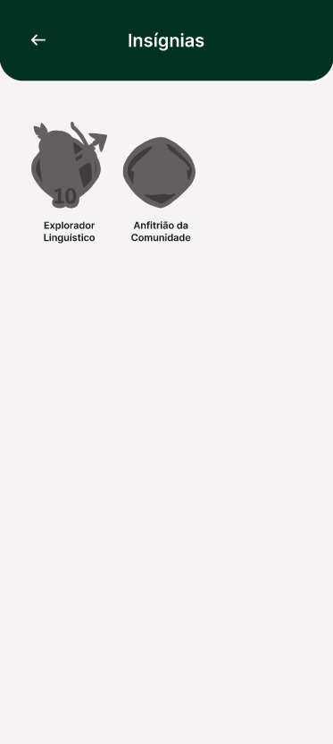
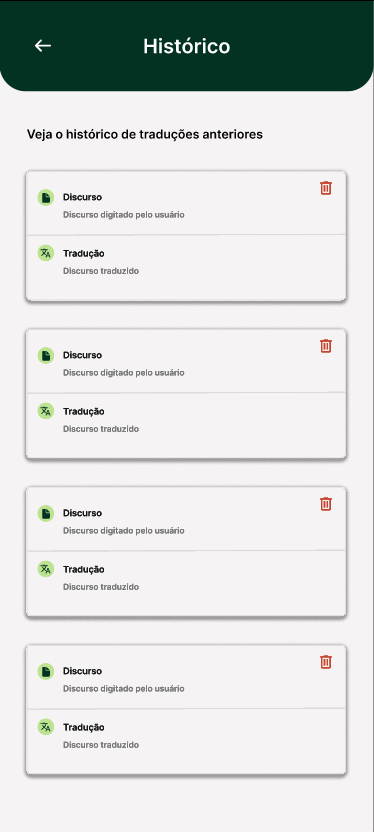
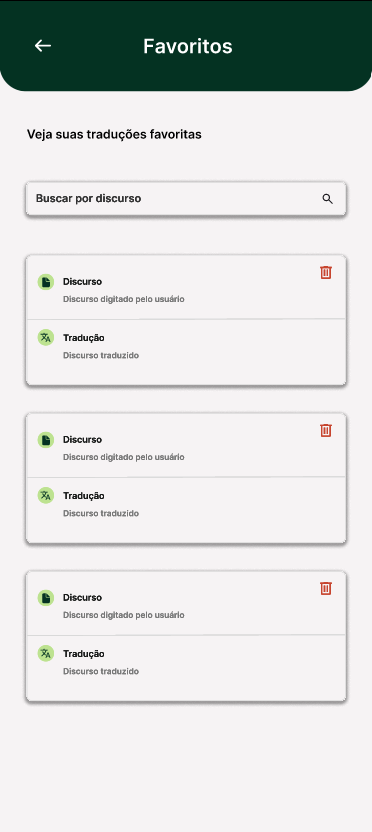
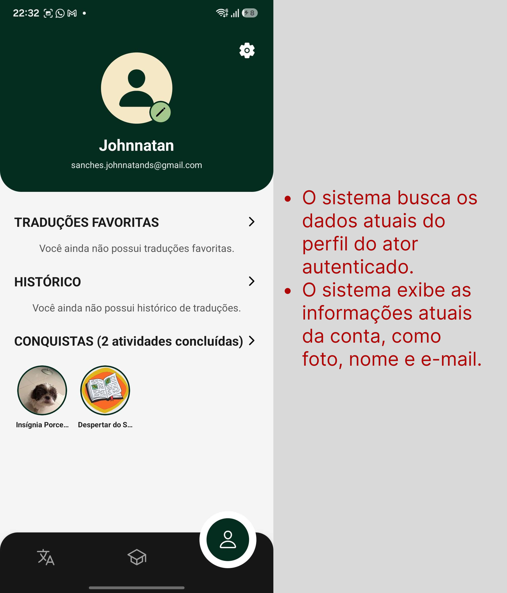
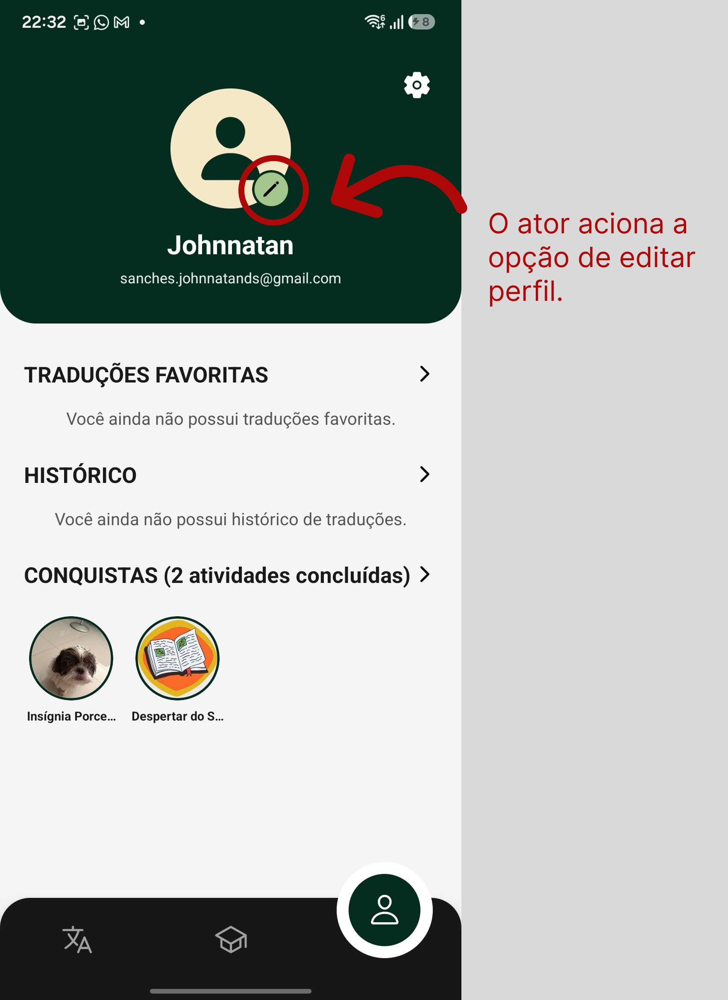
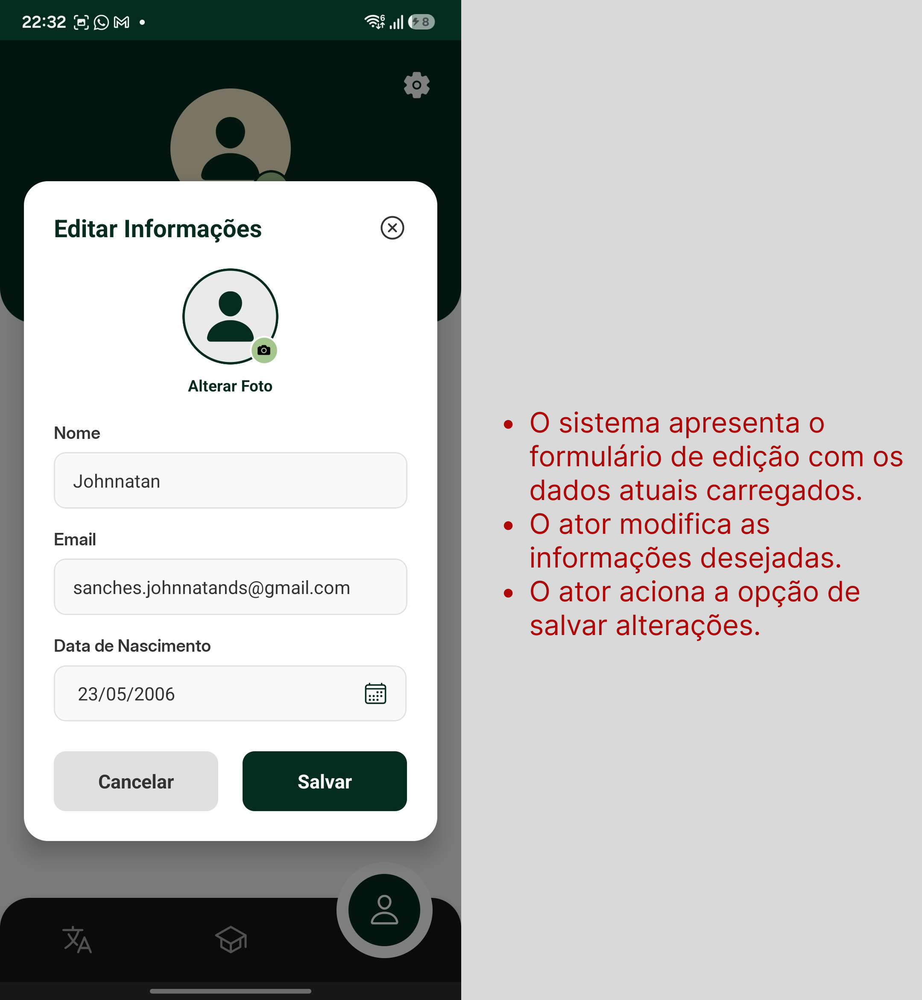

# UC12 - Gerenciar Perfil Pessoal

[Voltar para Casos de Uso](../backlog.md#9-casos-de-uso)

## 1. Atores

**Atores principais:** Usuário

## 2. Objetivo

Permitir que o usuário autenticado edite as informações pessoais de seu perfil, visualize seu histórico de traduções, marque traduções como favoritas e acesse rapidamente a lista de traduções favoritadas.

## 3. Pré-condições

1. O ator deve estar autenticado no aplicativo móvel.
2. O ator deve possuir perfil cadastrado no sistema.
3. O sistema deve possuir conexão com o backend para consultar, atualizar e persistir dados.
4. O backend deve estar integrado ao banco de dados Firebase/Firestore.
5. Para listar histórico, o ator deve possuir traduções previamente realizadas.
6. Para listar favoritos, o ator deve possuir traduções previamente marcadas como favoritas.

## 4. Fluxo Principal

**FP01 - Editar Dados do Perfil**

1. O ator acessa a aba de perfil pessoal no menu do aplicativo. ([RF44](#uc12-rf44))
2. O sistema busca os dados atuais do perfil do ator autenticado. ([RF44](#uc12-rf44))
3. O sistema exibe as informações atuais da conta, como foto, nome e e-mail. ([RF44](#uc12-rf44))
4. O ator aciona a opção de editar perfil. ([RF44](#uc12-rf44))
5. O sistema apresenta o formulário de edição com os dados atuais carregados. ([RF44](#uc12-rf44))
6. O ator modifica as informações desejadas. ([RF44](#uc12-rf44))
7. O ator aciona a opção de salvar alterações. ([RF44](#uc12-rf44))
8. O sistema valida os dados informados. ([RF44](#uc12-rf44))
9. O sistema atualiza os dados do perfil no banco de dados. ([RF44](#uc12-rf44))
10. O sistema recarrega a tela de perfil com as informações atualizadas. ([RF44](#uc12-rf44))
11. O sistema exibe mensagem de sucesso informando que o perfil foi atualizado. ([RF44](#uc12-rf44))

## 5. Fluxos Alternativos

**FA01 - Listar Histórico de Traduções**

1. O ator acessa a aba de perfil pessoal no aplicativo. ([RF45](#uc12-rf45))
2. O ator acessa a seção de histórico de traduções. ([RF45](#uc12-rf45))
3. O sistema busca as traduções realizadas pelo ator autenticado. ([RF45](#uc12-rf45))
4. O sistema organiza o histórico de traduções em ordem cronológica. ([RF45](#uc12-rf45))
5. O sistema exibe as traduções realizadas, contendo data e resultado da tradução. ([RF45](#uc12-rf45))
6. O ator visualiza seu histórico de traduções. ([RF45](#uc12-rf45))

**FA02 - Favoritar Tradução**

1. O ator acessa uma tradução específica no aplicativo. ([RF46](#uc12-rf46))
2. O sistema exibe o resultado da tradução selecionada. ([RF46](#uc12-rf46))
3. O ator aciona a opção de favoritar tradução. ([RF46](#uc12-rf46))
4. O sistema verifica se a tradução ainda não está marcada como favorita para o ator. ([RF46](#uc12-rf46))
5. O sistema registra a tradução na lista de favoritos do ator. ([RF46](#uc12-rf46))
6. O sistema atualiza o estado visual da tradução como favorita. ([RF46](#uc12-rf46))
7. O sistema exibe confirmação de que a tradução foi adicionada aos favoritos. ([RF46](#uc12-rf46))

**FA03 - Listar Traduções Favoritadas**

1. O ator acessa a aba de perfil pessoal no aplicativo. ([RF47](#uc12-rf47))
2. O ator acessa a seção de traduções favoritas. ([RF47](#uc12-rf47))
3. O sistema busca as traduções marcadas como favoritas pelo ator autenticado. ([RF47](#uc12-rf47))
4. O sistema exibe a lista atualizada de traduções favoritadas. ([RF47](#uc12-rf47))
5. O ator visualiza rapidamente suas traduções marcadas como favoritas. ([RF47](#uc12-rf47))
6. O ator pode selecionar uma tradução favorita para acessar seu conteúdo. ([RF47](#uc12-rf47))

**FA04 - Histórico de Traduções Vazio**

1. O ator acessa a seção de histórico de traduções. ([RF45](#uc12-rf45))
2. O sistema consulta o histórico do ator autenticado. ([RF45](#uc12-rf45))
3. O sistema identifica que o ator ainda não possui traduções registradas. ([RF45](#uc12-rf45))
4. O sistema exibe mensagem informando que não há traduções no histórico. ([RF45](#uc12-rf45))

**FA05 - Lista de Favoritos Vazia**

1. O ator acessa a seção de traduções favoritas. ([RF47](#uc12-rf47))
2. O sistema consulta as traduções favoritadas pelo ator autenticado. ([RF47](#uc12-rf47))
3. O sistema identifica que o ator ainda não possui traduções favoritas. ([RF47](#uc12-rf47))
4. O sistema exibe mensagem informando que não há traduções favoritadas. ([RF47](#uc12-rf47))

**FA06 - Cancelar Edição do Perfil**

1. Durante a edição do perfil, o ator aciona a opção de cancelar ou voltar. ([RF44](#uc12-rf44))
2. O sistema descarta as alterações não salvas. ([RF44](#uc12-rf44))
3. O sistema retorna o ator para a tela de perfil pessoal. ([RF44](#uc12-rf44))
4. Nenhuma informação do perfil é alterada no banco de dados. ([RF44](#uc12-rf44))

**FA07 - Listar Insígnias do Usuário**

1. O ator acessa a aba de perfil pessoal no aplicativo. ([RF48](#uc12-rf48))
2. O sistema busca as insígnias associadas ao ator autenticado. ([RF48](#uc12-rf48))
3. O sistema exibe a lista de insígnias obtidas pelo ator. ([RF48](#uc12-rf48))
4. O ator acessa a seção de visualização integral das insígnias, onde visualiza as que já possui e as que ainda estão bloqueadas. ([RF48](#uc12-rf48))

## 6. Fluxos de Exceção

**FE01 - Dados Inválidos na Edição do Perfil**

1. O ator tenta salvar o perfil com dados inválidos. ([RF44](#uc12-rf44))
2. O sistema identifica inconsistências, como nome em branco, e-mail em formato inválido, senha em formato inválido ou data de nascimento inválida. ([RF44](#uc12-rf44))
3. O sistema impede o salvamento das alterações. ([RF44](#uc12-rf44))
4. O sistema destaca os campos inválidos. ([RF44](#uc12-rf44))
5. O sistema informa ao ator que os dados devem ser corrigidos. ([RF44](#uc12-rf44))

**FE02 - Falha de Conectividade**

1. O ator tenta editar perfil, listar histórico, favoritar tradução ou listar favoritos sem conexão com o backend. ([RF44](#uc12-rf44), [RF45](#uc12-rf45), [RF46](#uc12-rf46), [RF47](#uc12-rf47))
2. O sistema não consegue concluir a operação. ([RF44](#uc12-rf44), [RF45](#uc12-rf45), [RF46](#uc12-rf46), [RF47](#uc12-rf47))
3. O sistema exibe mensagem de falha de conexão. ([RF44](#uc12-rf44), [RF45](#uc12-rf45), [RF46](#uc12-rf46), [RF47](#uc12-rf47))
4. O sistema orienta o ator a tentar novamente quando a conexão for restabelecida. ([RF44](#uc12-rf44), [RF45](#uc12-rf45), [RF46](#uc12-rf46), [RF47](#uc12-rf47))

**FE03 - Erro Interno no Banco de Dados**

1. O ator realiza uma operação válida envolvendo perfil, histórico ou favoritos. ([RF44](#uc12-rf44), [RF45](#uc12-rf45), [RF46](#uc12-rf46), [RF47](#uc12-rf47))
2. O sistema tenta consultar, registrar ou atualizar os dados no Firebase/Firestore. ([RF44](#uc12-rf44), [RF45](#uc12-rf45), [RF46](#uc12-rf46), [RF47](#uc12-rf47))
3. O banco de dados retorna erro ou indisponibilidade. ([RF44](#uc12-rf44), [RF45](#uc12-rf45), [RF46](#uc12-rf46), [RF47](#uc12-rf47))
4. O sistema cancela a operação. ([RF44](#uc12-rf44), [RF45](#uc12-rf45), [RF46](#uc12-rf46), [RF47](#uc12-rf47))
5. O sistema exibe mensagem de erro interno. ([RF44](#uc12-rf44), [RF45](#uc12-rf45), [RF46](#uc12-rf46), [RF47](#uc12-rf47))

**FE04 - Tradução Indisponível por Estado Desatualizado**

1. O ator visualiza uma tradução antes da atualização completa do estado no banco ou na interface. ([RF46](#uc12-rf46), [RF47](#uc12-rf47))
2. O ator tenta favoritar ou acessar a tradução pela lista de favoritos. ([RF46](#uc12-rf46), [RF47](#uc12-rf47))
3. O sistema revalida a disponibilidade da tradução no backend. ([RF46](#uc12-rf46), [RF47](#uc12-rf47))
4. O sistema identifica que a tradução foi removida, alterada ou tornou-se indisponível. ([RF46](#uc12-rf46), [RF47](#uc12-rf47))
5. O sistema impede a operação solicitada. ([RF46](#uc12-rf46), [RF47](#uc12-rf47))
6. O sistema atualiza os dados exibidos ao ator. ([RF46](#uc12-rf46), [RF47](#uc12-rf47))
7. O sistema informa que a tradução não está mais disponível. ([RF46](#uc12-rf46), [RF47](#uc12-rf47))

**FE05 - Tentativa de Acesso sem Autenticação**

1. O ator tenta acessar o perfil pessoal, histórico ou favoritos sem estar autenticado. ([RF44](#uc12-rf44), [RF45](#uc12-rf45), [RF47](#uc12-rf47))
2. O sistema identifica a ausência de sessão válida. ([RF44](#uc12-rf44), [RF45](#uc12-rf45), [RF47](#uc12-rf47))
3. O sistema bloqueia o acesso às informações pessoais. ([RF44](#uc12-rf44), [RF45](#uc12-rf45), [RF47](#uc12-rf47))
4. O sistema direciona o ator para a autenticação. ([RF44](#uc12-rf44), [RF45](#uc12-rf45), [RF47](#uc12-rf47))

## 7. Regras de Negócio

- [RN10 - Ordenação cronológica de publicações e históricos](../requisitos.md#req-rn10)
- [RN14 - Alteração restrita aos dados da própria conta](../requisitos.md#req-rn14)
- [RN21 - Bloqueio de favoritos duplicados e ocultação de traduções indisponíveis](../requisitos.md#req-rn21)

## 8. Requisitos Relacionados

| RF | Relação com a UC |
| :--- | :--- |
| [**RF44 - Editar usuário**](../requisitos.md#req-rf44) | Permite que os usuários editem as informações pessoais de seus perfis. |
| [**RF45 - Listar histórico de traduções**](../requisitos.md#req-rf45) | Permite que os usuários visualizem o histórico de traduções realizadas, com data e resultado. |
| [**RF46 - Favoritar tradução**](../requisitos.md#req-rf46) | Permite que o usuário marque traduções específicas como favoritas. |
| [**RF47 - Listar traduções favoritadas**](../requisitos.md#req-rf47) | Permite que o usuário visualize rapidamente a lista de suas traduções marcadas como favoritas. |
| [**RF48 - Listar insígnias**](../requisitos.md#req-rf48) | Permite que o usuário visualize suas insígnias obtidas e as insígnias ainda bloqueadas no perfil. |

## 9. Protótipo

{ width=250px }
{ width=250px }
{ width=250px }
{ width=250px }
{ width=250px }

**Link do Figma:** [Figma](https://www.figma.com/design/uTKEQkRbmnBttLtu5jbt1w/Nativo?node-id=18-477&t=D7Xf5gRy0B9D4pv3-1)

## 10. Aplicação do DoR

**Aplicação do DoR:** [Issue Uc12](https://github.com/mdsreq-fga-unb/REQ-2026.1-T02-Nativo/issues/31)

**Print do checklist DoR:**

## 11. Fluxo de Acesso à UC

{ width=250px }
{ width=250px }
{ width=250px }
{ width=250px }

---

[Próxima: UC13 - Baixar Traduções para Acesso Offline](uc13.md)
