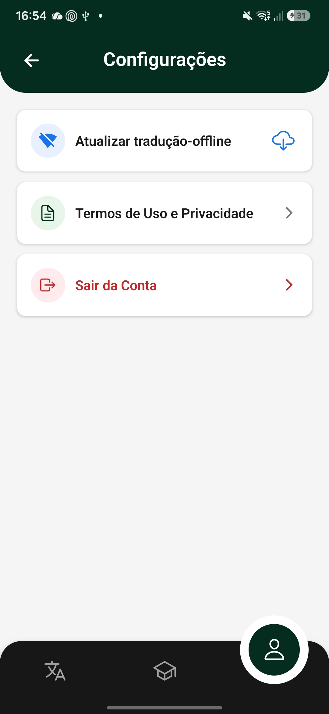
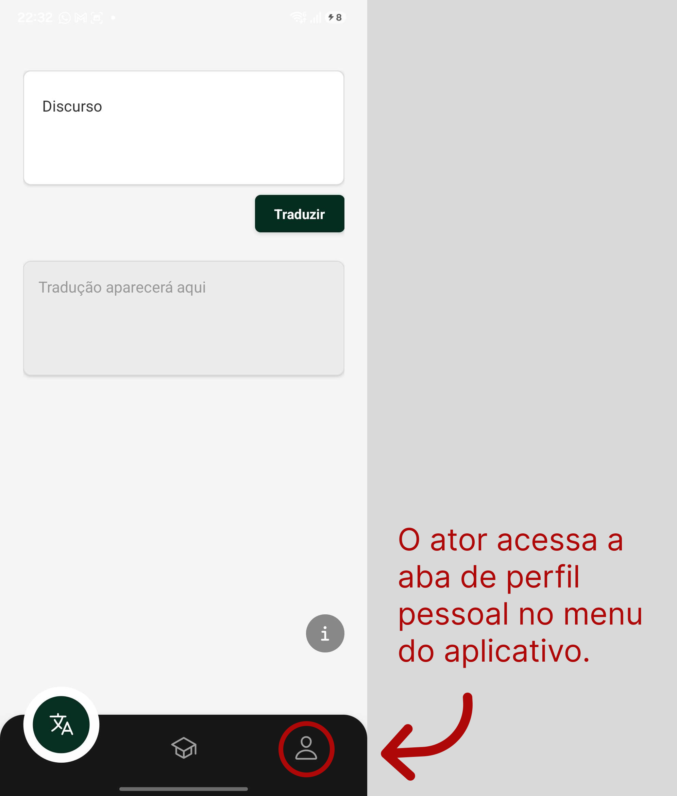
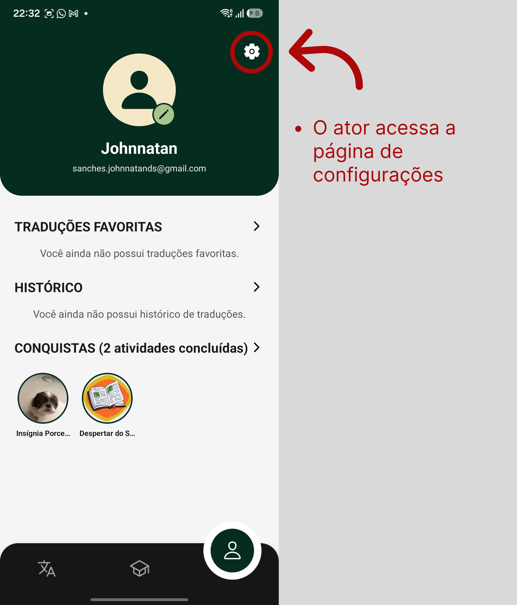
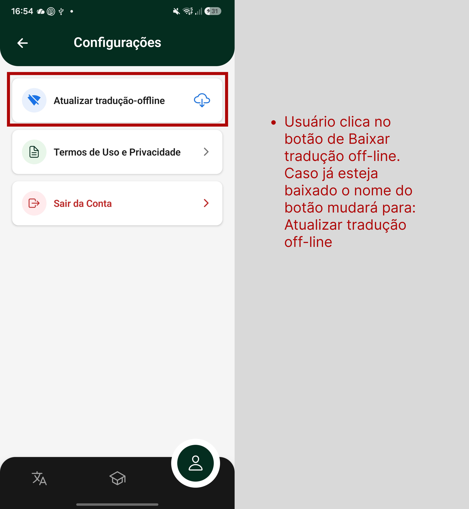

# UC13 - Baixar Traduções para Acesso Offline

[Voltar para Casos de Uso](../backlog.md#9-casos-de-uso)

## 1. Atores

**Atores principais:** Usuário autenticado

## 2. Objetivo

Permitir que usuários realizem o download das traduções textuais e auditivas para acesso ao dicionário mesmo quando o dispositivo estiver sem conexão com a internet.

## 3. Pré-condições

1. O ator deve estar autenticado no aplicativo.
2. O dispositivo deve possuir conexão com a internet para realizar a sincronização.
3. O dispositivo deve possuir espaço de armazenamento disponível.
4. O sistema deve possuir conexão ativa com o backend.
5. O backend deve estar integrado ao banco de dados Firebase/Firestore.

## 4. Fluxo Principal

**FP01 - Baixar Traduções para Uso Offline**

1. O usuário acessa a página de sincronização ou modo offline. ([RF49](#uc13-rf49))
2. O sistema calcula o tamanho estimado do pacote de traduções. ([RF49](#uc13-rf49))
3. O sistema apresenta as informações do download e solicita confirmação. ([RF49](#uc13-rf49))
4. O usuário confirma o início da sincronização. ([RF49](#uc13-rf49))
5. O sistema realiza o download das traduções textuais e dos arquivos de áudio. ([RF49](#uc13-rf49))
6. O sistema armazena os dados no armazenamento local do dispositivo. ([RF49](#uc13-rf49))
7. O sistema apresenta o progresso da sincronização. ([RF49](#uc13-rf49))
8. O sistema registra a data da última sincronização realizada. ([RF49](#uc13-rf49))
9. O sistema informa que o download foi concluído com sucesso. ([RF49](#uc13-rf49))

## 5. Fluxos Alternativos

**FA01 - Consultar Traduções em Modo Offline**

1. O usuário abre o aplicativo sem conexão com a internet. ([RF49](#uc13-rf49))
2. O sistema identifica a ausência de conexão. ([RF49](#uc13-rf49))
3. O sistema ativa automaticamente o modo offline. ([RF49](#uc13-rf49))
4. O sistema mantém disponíveis apenas as funcionalidades compatíveis com o modo offline. ([RF49](#uc13-rf49))
5. O usuário pesquisa uma tradução. ([RF49](#uc13-rf49))
6. O sistema consulta os dados armazenados localmente e apresenta o resultado. ([RF49](#uc13-rf49))

**FA02 - Atualizar Pacote Offline**

1. O usuário acessa novamente a tela de sincronização. ([RF49](#uc13-rf49))
2. O sistema verifica a existência de atualizações disponíveis. ([RF49](#uc13-rf49))
3. O usuário confirma a atualização do pacote. ([RF49](#uc13-rf49))
4. O sistema realiza a sincronização apenas dos conteúdos necessários. ([RF49](#uc13-rf49))
5. O sistema atualiza a data da última sincronização. ([RF49](#uc13-rf49))

**FA03 - Cancelar Download**

1. Durante o download das traduções, o usuário seleciona a opção de cancelar. ([RF49](#uc13-rf49))
2. O sistema interrompe a sincronização. ([RF49](#uc13-rf49))
3. O sistema mantém apenas os dados já sincronizados anteriormente. ([RF49](#uc13-rf49))
4. O sistema retorna para a tela de sincronização. ([RF49](#uc13-rf49))

## 6. Fluxos de Exceção

**FE01 - Espaço de Armazenamento Insuficiente**

1. O usuário confirma o download das traduções. ([RF49](#uc13-rf49))
2. O sistema verifica o espaço disponível no dispositivo. ([RF49](#uc13-rf49))
3. O sistema identifica que não há espaço suficiente. ([RF49](#uc13-rf49))
4. O sistema cancela a sincronização. ([RF49](#uc13-rf49))
5. O sistema informa que é necessário liberar espaço antes de tentar novamente. ([RF49](#uc13-rf49))

**FE02 - Falha de Conexão Durante o Download**

1. O sistema realiza a sincronização das traduções. ([RF49](#uc13-rf49))
2. A conexão com a internet é interrompida. ([RF49](#uc13-rf49))
3. O sistema pausa o download automaticamente. ([RF49](#uc13-rf49))
4. O sistema salva o progresso realizado. ([RF49](#uc13-rf49))
5. O sistema informa que a sincronização será retomada quando a conexão for restabelecida. ([RF49](#uc13-rf49))

**FE03 - Falha na Gravação Local**

1. O sistema conclui o download das traduções. ([RF49](#uc13-rf49))
2. O sistema tenta salvar os dados no armazenamento do dispositivo. ([RF49](#uc13-rf49))
3. O armazenamento retorna erro durante a gravação. ([RF49](#uc13-rf49))
4. O sistema cancela a sincronização. ([RF49](#uc13-rf49))
5. O sistema informa que ocorreu um erro ao salvar os arquivos localmente. ([RF49](#uc13-rf49))

**FE04 - Pacote de Traduções Indisponível**

1. O usuário solicita o download das traduções. ([RF49](#uc13-rf49))
2. O sistema tenta acessar o pacote de sincronização. ([RF49](#uc13-rf49))
3. O pacote encontra-se indisponível no servidor. ([RF49](#uc13-rf49))
4. O sistema interrompe a sincronização. ([RF49](#uc13-rf49))
5. O sistema informa que o serviço está temporariamente indisponível. ([RF49](#uc13-rf49))

**FE05 - Erro Interno no Banco de Dados**

1. O sistema tenta registrar a sincronização realizada. ([RF49](#uc13-rf49))
2. O banco de dados retorna erro ou indisponibilidade. ([RF49](#uc13-rf49))
3. O sistema cancela a operação. ([RF49](#uc13-rf49))
4. O sistema exibe mensagem de erro interno. ([RF49](#uc13-rf49))

## 7. Regras de Negócio

- [RN22 - Restrições do pacote de sincronização offline](../requisitos.md#req-rn22)

## 8. Requisitos Relacionados

| RF | Relação com a UC |
| :--- | :--- |
| [**RF49 - Baixar traduções**](../requisitos.md#req-rf49) | Permite que os usuários façam o download das traduções textuais e auditivas para acesso offline. |

## 9. Protótipo

{ width=250px }

## 10. Aplicação do DoR

**Aplicação do DoR:** [Issue Uc13](https://github.com/mdsreq-fga-unb/REQ-2026.1-T02-Nativo/issues/32)

**Print do checklist DoR:**

## 11. Fluxo de Acesso à UC

{ width=250px }
{ width=250px }
{ width=250px }

---

[Próxima: UC14 - Candidatar-se a Professor](uc14.md)
