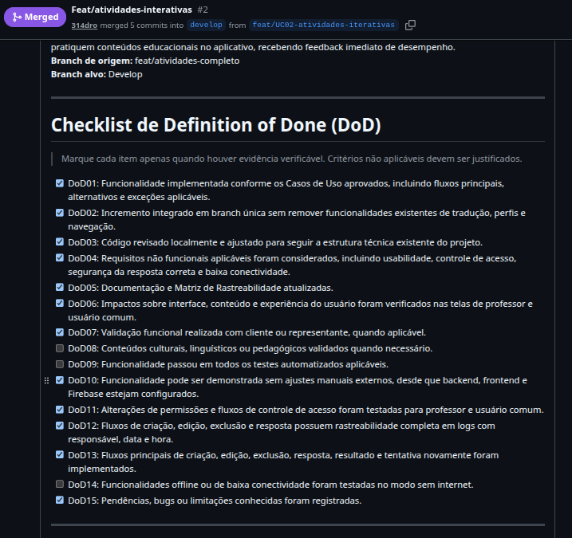
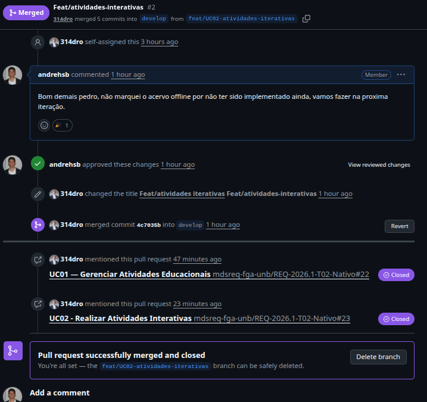

# 9 · DoR e DoD

Para apoiar a condução iterativa e incremental do projeto Nativo, foram definidos critérios de Definition of Ready (DoR) e Definition of Done (DoD). Esses acordos têm como finalidade tornar explícito quando um item está suficientemente preparado para ser desenvolvido e quando uma entrega pode ser considerada efetivamente concluída.

A adoção desses critérios se relaciona diretamente ao processo de validação definido para o projeto, no qual as especificações e cenários dos Casos de Uso devem estar claros antes de entrarem em desenvolvimento, e os incrementos produzidos precisam passar por testes de cobertura de fluxos, integração e validação funcional antes de compor a versão final da aplicação. Além disso, esses acordos contribuem para manter a rastreabilidade entre os objetivos específicos, as características do produto, os requisitos, os Casos de Uso e as entregas realizadas ao longo das iterações.

## 9.1 Definition of Ready (DoR)

O Definition of Ready estabelece as condições mínimas para que um Caso de Uso ou cenário da lista de trabalho esteja apto a ser selecionado para uma iteração de desenvolvimento. No contexto do Nativo, um item será considerado pronto quando apresentar informações suficientes para que a equipe consiga implementá-lo com segurança, sem depender de decisões essenciais ainda em aberto.

Para isso, devem ser verificados os seguintes critérios:

* O Caso de Uso está formalmente descrito, contendo de forma clara e sem ambiguidades a identificação dos atores, pré-condições, pós-condições e o detalhamento do fluxo principal.

* Há relação identificável com ao menos um objetivo específico, característica de produto ou requisito funcional/não funcional na Matriz de Rastreabilidade.

* O Caso de Uso está acompanhado de critérios de aceitação e regras de negócio claras que permitam verificar a conclusão de todos os seus cenários.

* As regras de negócio necessárias para sua implementação já foram compreendidas e registradas.

* Quando houver impacto de interface, existe o protótipo ou wireframe correspondente navegável para orientar o desenvolvimento.

* As dependências técnicas, riscos e impactos arquiteturais relevantes foram analisados previamente.

* O escopo do Caso de Uso ou do fluxo selecionado é compatível com a duração de uma iteração.

* A representante do projeto já validou o entendimento do caso de uso, atestando o pré-requisito de valor cultural e sua adequação ao contexto de uso da comunidade.

## 9.2 Definition of Done (DoD)

O Definition of Done define os critérios que devem ser atendidos para que uma funcionalidade seja considerada concluída pela equipe. No projeto Nativo, um item não será tratado como finalizado apenas por estar implementado no código; ele deverá demonstrar que entrega valor ao produto, mantém a qualidade técnica esperada e está validado em relação às necessidades do projeto.

Um item será considerado concluído quando:

* A funcionalidade estiver implementada conforme a especificação textual do Caso de Uso, cobrindo com sucesso o fluxo principal, alternativos e seus critérios de aceitação.

* Os testes de desenvolvedor aplicáveis, incluindo testes unitários e de integração, tiverem sido executados com sucesso.

* O incremento estiver integrado à base principal do projeto sem comprometer funcionalidades existentes.

* O código estiver revisado pela equipe e aderente aos padrões técnicos definidos para o projeto.

* A funcionalidade respeitar os requisitos não funcionais relacionados, como facilidade de uso, desempenho, engajamento e bom funcionamento da comunidade.

* A documentação pertinente e a matriz de rastreabilidade tiverem sido atualizadas.

* Os impactos sobre interface, conteúdo ou experiência do usuário tiverem sido verificados.

* A funcionalidade tiver passado por validação funcional em revisão com a cliente ou representante, por meio da execução prática e homologação dos fluxos descritos no Caso de Uso.

* No caso de conteúdos ou fluxos ligados à língua e à cultura Munduruku, a solução passa pela validação dos representantes, preservando a adequação cultural, ortográfica e pedagógica esperada para o contexto da comunidade.

## Evidências de Aplicação do DoR e DoD
Aplicação do DoR 

Aplicação do DoD 

