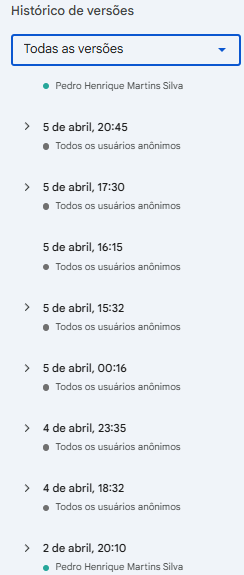

# Evidências da Iteração 1

[Voltar para o Cronograma](../cronograma.md#visao-geral-do-cronograma)

## Atividade de Engenharia de Requisitos

**Elicitação e descoberta:** entrevistas, brainstorming, análise documental e registro da visão inicial do produto.

## Evidências

Na Iteração 1, a equipe iniciou a documentação em um arquivo compartilhado, usando o Live Share durante as reuniões. A decisão funcionou para escrever em conjunto, mas foi um erro para rastrear o processo: a equipe ficou focada em definir corretamente os tópicos 1 a 6 e acabou perdendo parte do caminho percorrido até chegar nas decisões finais.

O principal problema foi a falta de evidências do processo. O histórico de versões do documento é difícil de visualizar e consultar, a reunião de primeiro contato com a cliente não foi gravada e as demais reuniões dessa etapa também não tiveram registro em vídeo. A partir do início da Unidade 2, na Iteração 2, a equipe corrigiu esse ponto e passou a registrar melhor as atividades, validações e entregas.

O brainstorming foi realizado durante as reuniões da equipe. As ideias finais foram consolidadas primeiro no documento compartilhado e, posteriormente, migradas para o GitPages.

A análise inicial usou como base o material de Requisitos de Software [[4]](../referencias.md#ref4) e o TCC original do Nativo [[5]](../referencias.md#ref5). Para pesquisa de competitividade e soluções similares, foram consultadas as referências Woolaroo [[1]](../referencias.md#ref1) e MANGUARÉ [[2]](../referencias.md#ref2).

**Print do histórico das primeiras versões do documento compartilhado:** 

**Registro das decisões da Unidade 1:** as decisões consolidadas nesta iteração estão registradas no [vídeo da Unidade 1](../../entregas/unidade1.md#video-da-unidade). A equipe também produziu [slides da Unidade 1](../../entregas/unidade1.md#slides) para facilitar a visualização das decisões tomadas.
