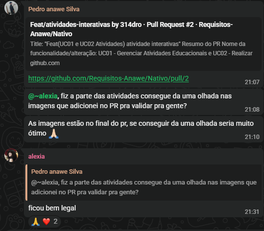
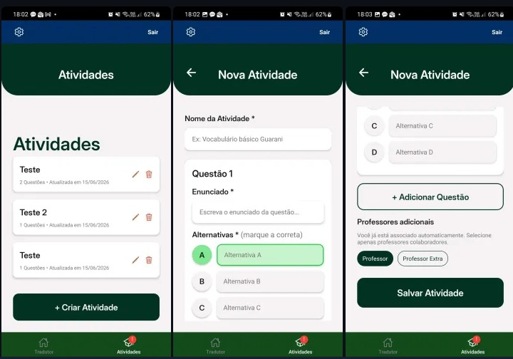
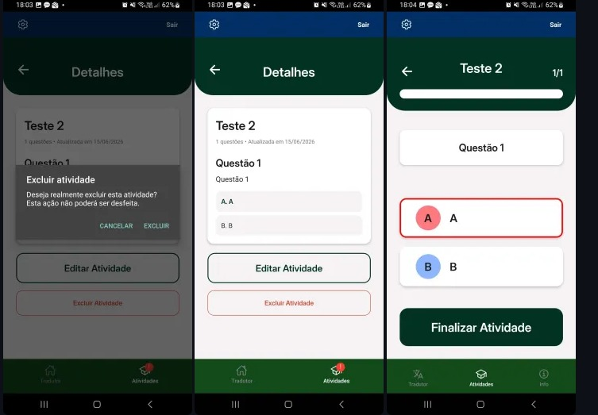
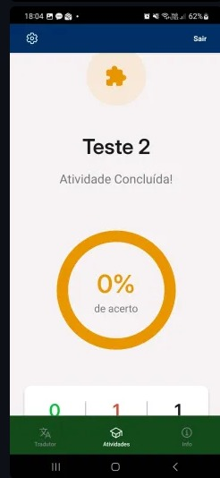

# Evidências da Iteração 6

[Voltar para o Cronograma](../cronograma.md#visao-geral-do-cronograma)

## Atividade de Engenharia de Requisitos

**Detalhamento de cenários e prototipação do módulo pedagógico:** evidências de criação, listagem, resposta e resultado de atividades.

## UCs Relacionadas

- [UC01 - Gerenciar Atividades Educacionais](../casos-uso/uc01.md)
- [UC02 - Responder Atividades Educacionais](../casos-uso/uc02.md)

## Evidências

### Validação com a Cliente da Área de Atividades

**Comunicação por WhatsApp:** A cliente precisou cancelar a reunião semanal, então a validação ocorreu por meio do WhatsApp. Abaixo estão as imagens da aplicação enviadas para validação.

