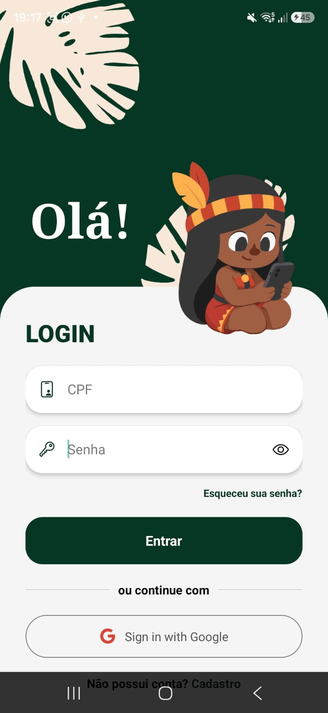
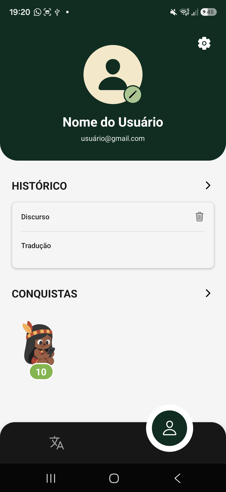
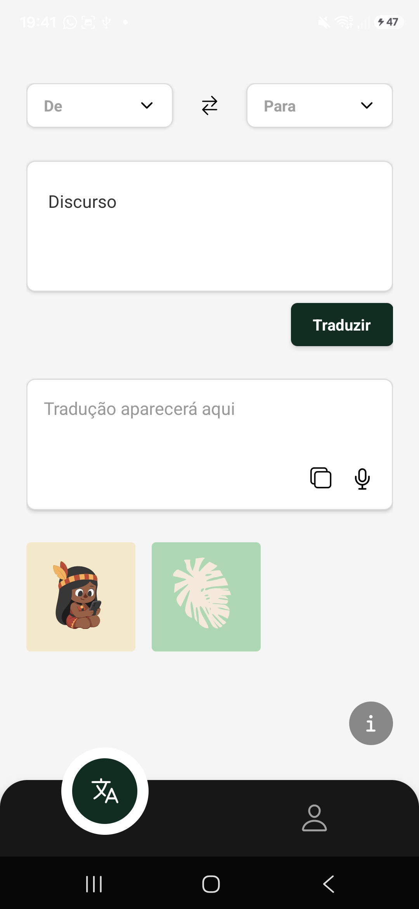
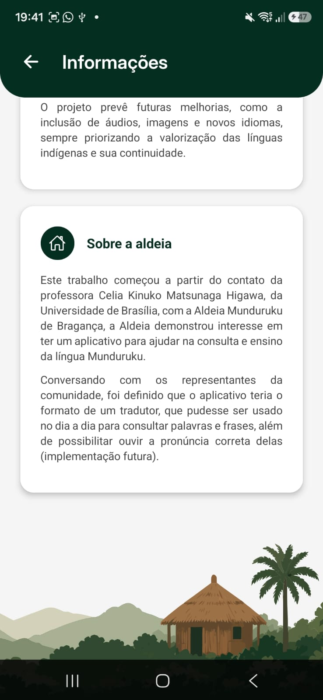

# Evidências da Iteração 8

[Voltar para o Cronograma](../cronograma.md#visao-geral-do-cronograma)

## Atividade de Engenharia de Requisitos

**Gestão de mudanças, detalhamento final e rastreabilidade:** evidências de perfil, favoritos, histórico, acesso e recuperação de senha.

## UCs Relacionadas

- [UC12 - Gerenciar Perfil Pessoal](../casos-uso/uc12.md)
- [UC06 - Gerenciar Acessos e Permissões](../casos-uso/uc06.md)
- [UC07 - Redefinir Senha de Acesso](../casos-uso/uc07.md)

## Evidências

### Revisão de Casos de Uso e Regras de Moderação

**Objetivo:** Retomar decisões de permissão, moderação e perfil para orientar o fechamento das funcionalidades implementadas nesta etapa.

  <iframe src="https://www.youtube.com/embed/-R0w7m4u6xA" width="640" height="360" frameborder="0" scrolling="no" allowfullscreen title="Revisão de Casos de Uso e Regras de Moderação"></iframe>

**Resumo da Reunião:** Para esta iteração, o registro foi usado como referência para fechar funcionalidades ligadas ao perfil e ao controle de acesso. A decisão de alocar traduções favoritas no perfil orientou a implementação de favoritos, histórico e organização das informações do usuário. As definições sobre permissões também serviram de base para separar responsabilidades entre moderadores e administradores, mantendo a avaliação de denúncias com moderadores e a ação de banimento ao administrador. Assim, as funcionalidades finais de perfil, permissões e recuperação de senha foram alinhadas às regras previamente validadas com a cliente.

### Implementações aguardando validação

**Refatoração de telas:** O protótipo no Figma já havia sido apresentado e aprovado pela cliente. Assim, a equipe implementou as telas e ficou no aguardo da próxima reunião para validação.

  
  
  
  
  

### Apresentação da Unidade 3

No momento desta iteração, a equipe apresentou um vídeo com a atualização do andamento do projeto naquele período: [ver apresentação da Unidade 3](../../entregas/unidade3.md#video-da-apresentacao).
