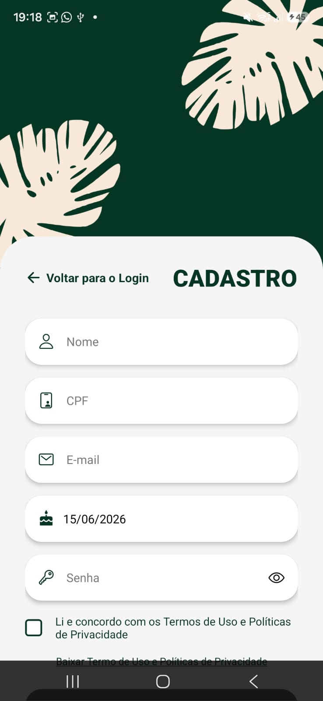

# Evidências da Iteração 9

[Voltar para o Cronograma](../cronograma.md#visao-geral-do-cronograma)

## Atividade de Engenharia de Requisitos

**Gestão de mudanças, detalhamento final e rastreabilidade:** evidências de perfil, favoritos, histórico, acesso e recuperação de senha.

## UCs Relacionadas

- [UC12 - Gerenciar Perfil Pessoal](../casos-uso/uc12.md)
- [UC06 - Gerenciar Acessos e Permissões](../casos-uso/uc06.md)
- [UC07 - Redefinir Senha de Acesso](../casos-uso/uc07.md)

## Evidências

### Vídeo da Apresentação da Unidade 3

  <iframe src="https://www.youtube.com/embed/_LcGL2ZW4JI" width="640" height="360" frameborder="0" allow="accelerometer; autoplay; clipboard-write; encrypted-media; gyroscope; picture-in-picture" allowfullscreen title="Apresentação unidade 3"></iframe>

### Revisão de Casos de Uso e Regras de Moderação

**Objetivo:** Validar os fluxos de interação, permissões de sistema e funcionalidades de tradução da plataforma.

  <iframe src="https://www.youtube.com/embed/-R0w7m4u6xA" width="640" height="360" frameborder="0" scrolling="no" allowfullscreen title="Revisão de Casos de Uso e Regras de Moderação"></iframe>

**Resumo da Reunião:** A reunião teve como foco a revisão dos casos de uso, permissões e regras de moderação. Foram discutidos gerenciamento de insígnias, categorias pré-definidas, permissões de moderadores e administradores, denúncias, traduções favoritas e perfil do usuário.

### Implementações aguardando validação

**Refatoração de telas:** O protótipo no Figma já havia sido apresentado e aprovado pela cliente. Assim, a equipe implementou as telas e ficou no aguardo da próxima reunião para validação.

  
  
  
  
  

